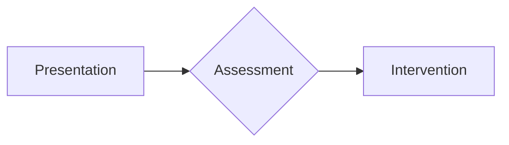

# SurgicalBrain — AI Synthesis & Serialization Guide

This guide explains how to generate medical synthesis notes that are compatible with the SurgicalBrain NoteTool serialization format. Use this guide to train custom AI skills (e.g., Surgical Synthesis Agent) or to create importable `.json` files.

---

## Table of Contents

1. [Metadata Schema (NoteData)](#1-metadata-schema-notedata)
2. [Content Serialization Format](#2-content-serialization-format)
3. [Complete JSON Import File (Ready to Use)](#3-complete-json-import-file-ready-to-use)
4. [Batch Import Script](#4-batch-import-script)
5. [In-App Import Mechanism](#5-in-app-import-mechanism)
6. [Custom Skill Definition: Surgical Synthesis Agent](#6-custom-skill-definition-surgical-synthesis-agent)
7. [Validation Rules & Best Practices](#7-validation-rules--best-practices)
8. [Export Formats Reference](#8-export-formats-reference)

---

## 1. Metadata Schema (NoteData)

Every note follows this internal TypeScript interface when serialized to JSON:

```typescript
interface NoteData {
  id: string;                       // lowercase-kebab-case, e.g. 'community-acquired-pneumonia'
  title: string;                    // Human-readable title, e.g. 'Community-Acquired Pneumonia (CAP)'
  category: string;                 // e.g. 'Respiratory'
  specialty: string;                // e.g. 'Respiratory Medicine / Infectious Disease'
  summary: string;                  // One-line clinical summary (≤200 chars)
  icd10Codes: string[];             // ICD-10 codes, e.g. ['J15.9', 'J18.9']
  snomedCodes: string[];            // SNOMED CT concept IDs, e.g. ['58419007']
  tags: string[];                   // e.g. ['pneumonia', 'respiratory', 'antibiotics', 'emergency']
  folder?: string;                  // Optional folder assignment, e.g. 'Cardiology'
  sections: NoteSection[];          // Ordered content sections
  highYieldSummary: string[];       // Bullet points for Dissection View (≤120 chars each)
  links: NoteLink[];                // Connections to other notes (the Connectome)
  ddxComparison?: DdxRow[];         // Differential diagnosis comparison table
  createdAt: number;                // Unix timestamp (ms)
  updatedAt: number;                // Unix timestamp (ms)
}

interface NoteSection {
  id: string;                       // Unique section ID, e.g. 'cap-overview'
  title: string;                    // Section heading
  type: 'content' | 'mcq' | 'flashcard' | 'mermaid' | 'algorithm' | 'tabs' | 'asset' | 'pdf-embed';
  content: unknown;                 // Varies by type (string | MCQData | FlashcardData | MermaidData | TabData | AssetRef)
}

interface NoteLink {
  targetId: string;                 // Target note ID
  relation: string;                 // e.g. 'differential-diagnosis', 'complication', 'management-pathway'
  label: string;                    // Display label, e.g. 'COPD Exacerbation', 'Sepsis'
}

interface DdxRow {
  feature: string;                  // e.g. 'Breath sound character'
  [key: string]: string;            // Dynamic keys: condition name → value
}
```

### Section Content Types

| `type` | `content` shape | Example |
|--------|----------------|---------|
| `content` | `string` (markdown) | Markdown text with GFM support |
| `mcq` | `MCQData` | `{ question, options[], correctIndex, explanation }` |
| `flashcard` | `FlashcardData` | `{ type: 'cloze'|'image-occlusion', front, back, tags[] }` |
| `mermaid` | `MermaidData` | `{ id, title, code }` (Mermaid.js syntax) |
| `algorithm` | `MermaidData` | Same as mermaid, alias for clinical algorithms |
| `tabs` | `TabData` | `{ tabs: [{ id, label, content }] }` |
| `asset` | `AssetRef` | `{ id, noteId, filename, type, caption, path }` |

---

## 2. Content Serialization Format

When importing via the UI (paste note), the body is a sequence of sections separated by `<!-- section-break -->`.

### Section Header Syntax
```
## [type] Title
```

### Supported Section Types in Markdown

#### A. Content (`[content]`)
```markdown
## [content] Pathophysiology
The underlying mechanism involves increased filling pressures...


<div style="padding: 12px; background: rgba(240,165,0,0.1); border-left: 4px solid #f0a500;">
  <strong>Clinical Pearl:</strong> Always check for S3 gallop.
</div>
```

#### B. Tabs (`[tabs]`)
```markdown
## [tabs] Investigations
### Tab: Bedside
- ECG: Look for ischemia/arrhythmia
- POCUS: Lung ultrasound (B-lines)

### Tab: Laboratory
- Troponin, NT-proBNP
- CBC, CMP, coagulation profile
```

#### C. Algorithms (`[mermaid]`)
Use triple-backtick with `mermaid` language tag:
```markdown
## [mermaid] Treatment Algorithm

```

#### D. Active Recall (`[mcq]`)
```markdown
## [mcq] Management Priority
```mcq
{
  "question": "A patient with AHF has SBP 85 mmHg and cold peripheries. Next step?",
  "options": ["IV Furosemide", "Inotropic support", "Beta-blocker", "Fluid bolus"],
  "correctIndex": 1,
  "explanation": "Cold and Dry/Wet with hypotension requires inotropic support (e.g. Dobutamine)."
}
```
```

---

## 3. Complete JSON Import File (Ready to Use)

Below is a **complete, production-ready JSON file** for **Community-Acquired Pneumonia (CAP)**. This file can be imported directly via the app's import mechanism or loaded into localStorage.

```json
{
  "id": "community-acquired-pneumonia",
  "title": "Community-Acquired Pneumonia (CAP)",
  "category": "Respiratory",
  "specialty": "Respiratory Medicine / Infectious Disease",
  "summary": "Acute infection of lung parenchyma acquired outside of healthcare settings. Caused primarily by Streptococcus pneumoniae, Haemophilus influenzae, and atypical organisms.",
  "folder": "Respiratory",
  "icd10Codes": ["J15.9", "J18.9", "J15.0", "J15.1"],
  "snomedCodes": ["58419007", "233604007", "53084003"],
  "tags": [
    "pneumonia",
    "respiratory",
    "antibiotics",
    "infectious-disease",
    "emergency",
    "curb-65",
    "chest-xray"
  ],
  "highYieldSummary": [
    "CAP = lung infection acquired outside healthcare settings",
    "Most common pathogen: Streptococcus pneumoniae",
    "Use CURB-65 score to determine inpatient vs outpatient",
    "Empiric Abx: Macrolide or Doxycycline for outpatients",
    "Inpatient: Beta-lactam + Macrolide (e.g., Ceftriaxone + Azithromycin)",
    "ICU: Beta-lactam + either Macrolide or Fluoroquinolone",
    "Duration: minimum 5 days (afebrile 48h + clinical stability)",
    "CXR shows lobar consolidation or interstitial infiltrates",
    "Key labs: WBC, CRP, Procalcitonin, Blood cultures x2",
    "Vaccination: PCV13/20 + PPSV23 + annual influenza"
  ],
  "links": [
    {
      "targetId": "acute-heart-failure",
      "relation": "differential-diagnosis",
      "label": "Acute Heart Failure (dyspnea mimic)"
    },
    {
      "targetId": "copd-exacerbation",
      "relation": "differential-diagnosis",
      "label": "COPD Exacerbation"
    },
    {
      "targetId": "sepsis-management",
      "relation": "complication",
      "label": "Sepsis & Septic Shock"
    },
    {
      "targetId": "pleural-effusion",
      "relation": "complication",
      "label": "Parapneumonic Effusion / Empyema"
    }
  ],
  "ddxComparison": [
    {
      "feature": "Onset",
      "CAP": "Acute (days)",
      "AHF": "Acute (hours)",
      "COPD Exacerbation": "Subacute (days)"
    },
    {
      "feature": "Fever",
      "CAP": "Common (>38.5°C)",
      "AHF": "Uncommon",
      "COPD Exacerbation": "Low-grade possible"
    },
    {
      "feature": "Sputum",
      "CAP": "Purulent, rusty",
      "AHF": "Pink frothy",
      "COPD Exacerbation": "Increased purulence"
    },
    {
      "feature": "CXR Pattern",
      "CAP": "Lobar consolidation",
      "AHF": "Interstitial edema, Kerley B",
      "COPD Exacerbation": "Hyperinflation, no infiltrate"
    },
    {
      "feature": "BNP",
      "CAP": "Normal-to-mild elevation",
      "AHF": "Elevated (>400 pg/mL)",
      "COPD Exacerbation": "Normal"
    }
  ],
  "sections": [
    {
      "id": "cap-overview",
      "title": "Overview & Definitions",
      "type": "content",
      "content": "## Definition\n\nCommunity-Acquired Pneumonia (CAP) is an acute infection of the lung parenchyma acquired outside of a hospital or long-term care facility. It remains a leading cause of morbidity and mortality worldwide.\n\n## Epidemiology\n- **Incidence**: ~5-10 cases per 1000 adults/year\n- **Mortality**: 5-15% (inpatient), 30-50% (ICU)\n- **Seasonal**: Peaks in winter months\n\n## Microbiology\n\n| Pathogen | Frequency | Typical Presentation |\n|----------|-----------|---------------------|\n| **Streptococcus pneumoniae** | 30-40% | Classic lobar pneumonia, rusty sputum |\n| **Haemophilus influenzae** | 10-15% | COPD patients, post-viral |\n| **Mycoplasma pneumoniae** | 10-20% | Young adults, dry cough, extrapulmonary |\n| **Chlamydophila pneumoniae** | 5-10% | Mild, biphasic illness |\n| **Legionella pneumophila** | 2-8% | Severe, multi-system (GI, CNS, electrolytes) |\n| **Staphylococcus aureus** | 3-5% | Post-influenza, cavitary lesions |\n| **Gram-negatives (Klebsiella, Pseudomonas)** | 5-10% | Alcoholism, comorbidities, healthcare contact |\n| **Viruses (Influenza, RSV, SARS-CoV-2)** | 15-25% | Biphasic illness, diffuse interstitial pattern |\n\n> **Clinical Pearl**: Atypical pathogens (Mycoplasma, Chlamydia, Legionella) do NOT respond to beta-lactams alone — always cover atypicals in empiric therapy."
    },
    {
      "id": "cap-clinical-features",
      "title": "Clinical Features & Risk Stratification",
      "type": "content",
      "content": "## Symptoms\n- **Cough** (90%) — initially dry, then productive\n- **Fever & rigors** (80%) — temperature >38.5°C\n- **Dyspnea** (70%) — correlates with severity\n- **Pleuritic chest pain** (50%) — indicates pleural involvement\n- **Sputum** — rusty (pneumococcal), purulent (bacterial), or absent (atypical)\n- **Extrapulmonary** — headache, myalgia, GI symptoms (more common with atypicals)\n\n## Signs\n- **Vitals**: Tachycardia, tachypnea, fever, ± hypotension\n- **Chest**: Bronchial breath sounds, dullness to percussion, egophony (\"E to A change\"), crackles\n- **General**: Confusion (especially in elderly), cyanosis (late)\n\n## CURB-65 Severity Score\n\n| Criteria | Point |\n|----------|-------|\n| **C**onfusion (new-onset, AMTS ≤8) | 1 |\n| **U**rea >7 mmol/L (BUN >20 mg/dL) | 1 |\n| **R**espiratory rate ≥30/min | 1 |\n| **B**lood pressure (SBP <90 OR DBP ≤60) | 1 |\n| Age ≥**65** | 1 |\n\n| Score | Risk Class | 30-day Mortality | Recommended Setting |\n|-------|-----------|-----------------|--------------------|\n| 0-1 | Low | <2% | Outpatient |\n| 2 | Moderate | 9% | Short-stay / Observation |\n| 3 | High | 22% | Inpatient / Medical ward |\n| 4-5 | Very High | 40-57% | ICU / High-dependency |\n\n> **Alternative**: PSI/PORT Score (Pneumonia Severity Index) — more comprehensive but less practical at bedside."
    },
    {
      "id": "cap-investigations",
      "title": "Investigations",
      "type": "tabs",
      "content": {
        "tabs": [
          {
            "id": "tab-bedside",
            "label": "Bedside",
            "content": "- **Vital signs**: HR, BP, RR, SpO2, temperature\n- **Chest X-ray (PA + lateral)**: Required for diagnosis\n  - Lobar consolidation — most specific\n  - Interstitial infiltrates — atypical/viral\n  - Cavitation — S. aureus, Klebsiella, anaerobes\n  - Pleural effusion — parapneumonic\n- **Arterial Blood Gas**: If SpO2 <92%, or severe CAP\n- **ECG**: Rule out cardiac causes of dyspnea"
          },
          {
            "id": "tab-lab",
            "label": "Laboratory",
            "content": "- **CBC**: WBC elevated with left shift (or low in elderly/immunocompromised)\n- **CRP**: Elevated, correlates with severity\n- **Procalcitonin**: >0.25 ng/mL suggests bacterial etiology\n- **Blood cultures ×2**: Before antibiotics (positive in only 10-15%)\n- **Sputum culture + Gram stain**: Quality specimen (PMNs >25, epithelial <10/LPF)\n- **Urinary antigen tests**:\n  - *Legionella pneumophila serogroup 1* antigen\n  - *Streptococcus pneumoniae* antigen\n- **Respiratory viral panel**: PCR (nasopharyngeal swab) — Influenza, RSV, SARS-CoV-2\n- **Renal/liver function**: Rule out end-organ damage\n- **Lactate**: If signs of sepsis"
          },
          {
            "id": "tab-imaging",
            "label": "Advanced Imaging",
            "content": "- **CT Chest**: Indicated if:\n  - CXR non-diagnostic with high suspicion\n  - Suspected complications (abscess, empyema)\n  - Non-resolving pneumonia (failure to improve after 72h)\n  - Immunocompromised host\n- **Lung Ultrasound**: Increasingly used — positive predictive sign = dynamic air bronchograms, subpleural consolidation, B-lines"
          }
        ]
      }
    },
    {
      "id": "cap-management",
      "title": "Management Algorithm",
      "type": "mermaid",
      "content": {
        "id": "cap-algorithm",
        "title": "CAP Empiric Treatment Algorithm",
        "code": "graph TD\n  A[Confirmed CAP] --> B{CURB-65}\n  B -->|0-1: Outpatient| C[No comorbidities]\n  B -->|0-1: Outpatient| D[Comorbidities]\n  B -->|2: Observation| E[Medical Ward]\n  B -->|3-5: Inpatient/ICU| F[ICU Criteria?]\n  \n  C --> G[Amoxicillin 1g TDS<br>OR Doxycycline 200mg stat + 100mg OD<br>OR Macrolide monotherapy]\n  D --> H[Co-amoxiclav 625mg TDS<br>OR Cefuroxime 500mg BD<br>PLUS Macrolide (Azithromycin 500mg OD)]\n  \n  E --> I[Beta-lactam IV + Macrolide<br>Ceftriaxone 2g OD + Azithromycin 500mg OD]\n  \n  F -->|Yes| J[ICU: Beta-lactam + Macrolide<br>OR Beta-lactam + Fluoroquinolone]<br>K[Cover Pseudomonas if risk factors]<br>L[Piperacillin-Tazobactam 4.5g Q6H<br>+ Ciprofloxacin 400mg BD / Levofloxacin 750mg OD]\n  F -->|No| M[Medical Ward: Ceftriaxone + Macrolide]\n  \n  subgraph Duration\n    N[Minimum 5 days<br>Afebrile ×48h + Clinical stability<br>4-7 days for severe CAP<br>14 days for Legionella/Staph]\n  end\n  \n  I --> N\n  J --> N\n  M --> N\n  G --> N\n  H --> N\n  \n  style A fill:#f0a500,color:#0d1117\n  style N fill:#2ea043,color:#0d1117"
      }
    },
    {
      "id": "cap-mcq-1",
      "title": "MCQ: Empiric Therapy Selection",
      "type": "mcq",
      "content": {
        "id": "cap-mcq-1",
        "question": "A 55-year-old man with a 40-pack-year smoking history and known COPD (on inhaled corticosteroids) presents with 4 days of fever (39.0°C), productive cough with purulent sputum, and confusion. RR 32/min, HR 110, BP 100/60, SpO2 88% on room air. CXR shows left lower lobe consolidation. CURB-65 = 3. What is the most appropriate empiric antibiotic regimen?",
        "options": [
          "Amoxicillin 1g PO TDS alone",
          "Ceftriaxone 2g IV OD + Azithromycin 500mg IV OD",
          "Piperacillin-Tazobactam 4.5g IV Q6H + Ciprofloxacin 400mg IV BD",
          "Doxycycline 200mg PO OD alone",
          "Azithromycin 500mg PO OD alone"
        ],
        "correctIndex": 1,
        "explanation": "This patient has severe CAP (CURB-65 = 3) requiring inpatient admission. The recommended empiric regimen for severe non-ICU CAP is a **beta-lactam + macrolide** (e.g., Ceftriaxone + Azithromycin). Option C (Piperacillin-Tazobactam + Ciprofloxacin) would be appropriate for ICU patients with Pseudomonas risk factors. Options A, D, and E are insufficient for severe CAP — monotherapy with any single agent does not provide adequate coverage."
      }
    },
    {
      "id": "cap-mcq-2",
      "title": "MCQ: Diagnostic Approach",
      "type": "mcq",
      "content": {
        "id": "cap-mcq-2",
        "question": "A 28-year-old previously healthy medical student presents with 5 days of dry cough, headache, myalgia, and low-grade fever (37.8°C). She has no dyspnea. CXR shows bilateral interstitial infiltrates. WBC 9.5, CRP 45, Procalcitonin 0.15. What is the most likely causative organism?",
        "options": [
          "Streptococcus pneumoniae",
          "Mycoplasma pneumoniae",
          "Staphylococcus aureus",
          "Klebsiella pneumoniae",
          "Legionella pneumophila"
        ],
        "correctIndex": 1,
        "explanation": "The presentation is classic for **Mycoplasma pneumoniae** pneumonia: young adult, subacute onset, dry cough, headache, bilateral interstitial pattern on CXR, low procalcitonin (<0.25 suggests non-bacterial or atypical etiology). S. pneumoniae would show lobar consolidation with high WBC and high procalcitonin. Legionella would be more severe with multi-system involvement. Klebsiella classically affects alcoholics with 'currant jelly' sputum. Staph aureus typically follows influenza with cavitary lesions."
      }
    },
    {
      "id": "cap-mcq-3",
      "title": "MCQ: Duration of Therapy",
      "type": "mcq",
      "content": {
        "id": "cap-mcq-3",
        "question": "A 70-year-old woman admitted for CAP (CURB-65 = 2) improves after 3 days of IV Ceftriaxone + Azithromycin. She is now afebrile for 48 hours, SpO2 96% on room air, and tolerating oral intake. What is the most appropriate management?",
        "options": [
          "Complete a 14-day course of IV antibiotics",
          "Switch to oral Amoxicillin-Clavulanate to complete a 5-day total course",
          "Switch to oral therapy to complete a 7-10 day total course",
          "Discharge with no further antibiotics",
          "Continue IV therapy for minimum 10 days"
        ],
        "correctIndex": 2,
        "explanation": "For CAP, the recommended **minimum duration is 5 days**, with extension to 7-10 days for severe cases. The patient should also meet clinical stability criteria (afebrile ×48h, RR <24, HR <100, SBP >90, SpO2 >90%, tolerating oral). Once these criteria are met, she can be **switched from IV to oral** to complete the course. A total of 7-10 days is appropriate given her initial severity (CURB-65 = 2)."
      }
    },
    {
      "id": "cap-flashcards",
      "title": "Flashcard Deck: CAP Essentials",
      "type": "flashcard",
      "content": {
        "id": "fc-cap-1",
        "type": "cloze",
        "front": "The most common cause of CAP is ___ pneumoniae.",
        "back": "Streptococcus",
        "tags": ["microbiology", "pneumonia"]
      }
    },
    {
      "id": "cap-second-flashcard",
      "title": "",
      "type": "flashcard",
      "content": {
        "id": "fc-cap-2",
        "type": "cloze",
        "front": "CURB-65: Confusion, Urea >7, RR ≥___ , BP <90/60, Age ≥___",
        "back": "30, 65",
        "tags": ["severity-score", "pneumonia"]
      }
    },
    {
      "id": "cap-third-flashcard",
      "title": "",
      "type": "flashcard",
      "content": {
        "id": "fc-cap-3",
        "type": "cloze",
        "front": "The minimum duration of antibiotic therapy for CAP is ___ days.",
        "back": "5",
        "tags": ["treatment", "duration"]
      }
    },
    {
      "id": "cap-four-flashcard",
      "title": "",
      "type": "flashcard",
      "content": {
        "id": "fc-cap-4",
        "type": "cloze",
        "front": "Procalcitonin >___ ng/mL suggests bacterial etiology in CAP.",
        "back": "0.25",
        "tags": ["diagnostics", "biomarkers"]
      }
    },
    {
      "id": "cap-complications",
      "title": "Complications",
      "type": "content",
      "content": "## Complications of CAP\n\n| Complication | Frequency | Management |\n|-------------|-----------|-----------|\n| **Parapneumonic effusion** | 20-40% | Observation if small; drainage if large/loculated |\n| **Empyema** | 5-10% | Chest tube drainage + prolonged Abx (4-6 weeks) |\n| **Lung abscess** | 2-5% | Prolonged Abx (4-8 weeks); drainage if >6cm |\n| **Sepsis / Septic shock** | 10-20% | Early recognition, fluids, vasopressors, source control |\n| **Respiratory failure** | 10-30% | NIV vs invasive ventilation per ARDS protocol |\n| **Acute Kidney Injury** | 15-25% | Fluid resuscitation, avoid nephrotoxins |\n| **Atrial fibrillation** | 5-15% | Rate control, correction of hypoxia/electrolytes |\n| **Myocardial infarction** | 3-8% | Increased risk due to inflammatory response |\n\n> **Clinical Pearl**: Failure to improve within 72 hours should prompt re-evaluation: wrong pathogen, wrong Abx, resistant organism, complication (empyema/abscess), or alternative diagnosis."
    },
    {
      "id": "cap-prevention",
      "title": "Prevention & Vaccination",
      "type": "content",
      "content": "## Vaccination Recommendations\n\n### Pneumococcal Vaccines\n- **PCV13/PCV20** (Prevnar): For all adults ≥65, or high-risk 19-64 (chronic heart/lung/liver disease, diabetes, immunocompromised, smokers)\n- **PPSV23** (Pneumovax): For all adults ≥65, or high-risk 19-64 (given 1 year after PCV)\n\n### Influenza Vaccine\n- **Annual**: All adults ≥6 months\n- Reduces CAP risk by ~50%\n\n### COVID-19 Vaccination\n- Updated booster annually\n- Reduces risk of viral pneumonia and superinfection\n\n### Other Preventive Measures\n- Smoking cessation (single most modifiable risk factor)\n- Alcohol moderation\n- Good oral hygiene (reduces aspiration risk)\n- Post-operative incentive spirometry"
    }
  ],
  "createdAt": 1746880000000,
  "updatedAt": 1746880000000
}
```

### How to Import

1. **Option A: localStorage injection** (dev/browser console):
   ```javascript
   // 1. Copy the JSON above
   // 2. Open browser console (F12)
   // 3. Read current state
   const store = JSON.parse(localStorage.getItem('notetool-store') || '{}');
   // 4. Find or create the notes array
   store.state.notes = store.state.notes || [];
   // 5. Add the note
   store.state.notes.push(YOUR_NOTE_OBJECT);
   // 6. Save back
   localStorage.setItem('notetool-store', JSON.stringify(store));
   // 7. Reload the page
   location.reload();
   ```

2. **Option B: Via import script** (see §4 below)

3. **Option C: Via in-app import mechanism** (see §5 below)

---

## 4. Batch Import Script

Save as `batch-import.js` and run with Node.js:

```javascript
/**
 * SurgicalBrain NoteTool — Batch Import Script
 * 
 * Usage: node batch-import.js <directory-of-json-files>
 * 
 * This script reads all .json files from the specified directory,
 * validates them against the NoteData schema, and writes a single
 * importable JSON file that can be loaded into localStorage.
 */

const fs = require('fs');
const path = require('path');

const args = process.argv.slice(2);
const sourceDir = args[0] || './import-notes';

if (!fs.existsSync(sourceDir)) {
  console.error(`❌ Directory not found: ${sourceDir}`);
  console.log(`Usage: node batch-import.js <directory-of-json-files>`);
  console.log(`     Or create a folder named 'import-notes' and run without arguments.`);
  process.exit(1);
}

// ─── Validation Schema ──────────────────────────────────────────────

const REQUIRED_FIELDS = ['id', 'title', 'category', 'summary', 'sections', 'highYieldSummary'];
const VALID_SECTION_TYPES = ['content', 'mcq', 'flashcard', 'mermaid', 'algorithm', 'tabs', 'asset', 'pdf-embed'];

function validateNote(note, filename) {
  const errors = [];

  // Check required fields
  for (const field of REQUIRED_FIELDS) {
    if (note[field] === undefined || note[field] === null) {
      errors.push(`Missing required field: '${field}'`);
    }
  }

  // Validate id format
  if (note.id && !/^[a-z0-9-]+$/.test(note.id)) {
    errors.push(`Invalid 'id': must be lowercase-kebab-case (got '${note.id}')`);
  }

  // Validate sections
  if (Array.isArray(note.sections)) {
    note.sections.forEach((section, i) => {
      if (!section.id) errors.push(`Section [${i}] missing 'id'`);
      if (!section.title && section.title !== '') errors.push(`Section [${i}] missing 'title'`);
      if (!VALID_SECTION_TYPES.includes(section.type)) {
        errors.push(`Section [${i}] invalid type '${section.type}'. Valid: ${VALID_SECTION_TYPES.join(', ')}`);
      }
    });
  }

  // Validate timestamps
  if (note.createdAt && typeof note.createdAt !== 'number') errors.push(`'createdAt' must be a unix timestamp (number)`);
  if (note.updatedAt && typeof note.updatedAt !== 'number') errors.push(`'updatedAt' must be a unix timestamp (number)`);

  return errors;
}

// ─── Process Files ──────────────────────────────────────────────────

const files = fs.readdirSync(sourceDir).filter(f => f.endsWith('.json'));
const validNotes = [];
const errors = [];

console.log(`\n📂 Scanning ${sourceDir} for .json note files...\n`);

for (const file of files) {
  const filePath = path.join(sourceDir, file);
  try {
    const raw = fs.readFileSync(filePath, 'utf-8');
    const note = JSON.parse(raw);
    const validationErrors = validateNote(note, file);

    if (validationErrors.length > 0) {
      errors.push({ file, errors: validationErrors });
      console.log(`❌ ${file} — ${validationErrors.length} validation error(s)`);
      validationErrors.forEach(e => console.log(`   • ${e}`));
    } else {
      validNotes.push(note);
      console.log(`✅ ${file} — "${note.title || note.id}"`);
    }
  } catch (err) {
    errors.push({ file, errors: [`Parse error: ${err.message}`] });
    console.log(`❌ ${file} — Parse error: ${err.message}`);
  }
}

// ─── Generate Import File ──────────────────────────────────────────

if (validNotes.length === 0) {
  console.log('\n⚠️  No valid notes found. Nothing to export.\n');
  process.exit(0);
}

const output = {
  _meta: {
    generator: 'SurgicalBrain Batch Import',
    generatedAt: Date.now(),
    totalFiles: files.length,
    validNotes: validNotes.length,
    errorCount: errors.length,
  },
  notes: validNotes,
};

const outputFile = path.join(process.cwd(), 'surgicalbrain-import.json');
fs.writeFileSync(outputFile, JSON.stringify(output, null, 2));
console.log(`\n📦 Generated import file: ${outputFile}`);
console.log(`   Contains ${validNotes.length} note(s) ready for import.\n`);

// ─── Instructions ──────────────────────────────────────────────────

console.log('To import into the app:');
console.log('  1. Copy the contents of surgicalbrain-import.json');
console.log('  2. Open the app and navigate to Settings → Import');
console.log('  3. Paste and confirm');
console.log('\nOr, to inject directly into localStorage:');
console.log(`  const data = JSON.parse(localStorage.getItem('notetool-store'));`);
console.log(`  data.state.notes = [...(data.state.notes || []), ${JSON.stringify(output.notes.map(n => n.id))}];`);
console.log(`  localStorage.setItem('notetool-store', JSON.stringify(data));`);
console.log(`  location.reload();\n`);
```

### Usage

```bash
# Create a directory of JSON note files
mkdir import-notes
# Place your .json files (like the CAP example above) in import-notes/

# Run the importer
node batch-import.js import-notes

# Output: surgicalbrain-import.json — one combined import file
```

---

## 5. In-App Import Mechanism

### Import Button (to add to the app)

Add this to any settings/import page:

```tsx
// ImportButton.tsx — Paste JSON to import a note
'use client';

import { useState } from 'react';
import { useNoteToolStore } from '@/stores/notetool-store';

export function ImportButton() {
  const [open, setOpen] = useState(false);
  const [jsonInput, setJsonInput] = useState('');
  const [feedback, setFeedback] = useState('');
  const addNote = useNoteToolStore((s) => s.addNote);

  const handleImport = () => {
    try {
      const parsed = JSON.parse(jsonInput);

      // Handle single note or batch format
      const notesToImport = parsed.notes || [parsed];

      let imported = 0;
      for (const note of notesToImport) {
        if (note.id && note.title && note.sections) {
          addNote(note);
          imported++;
        }
      }

      setFeedback(`✅ Imported ${imported} note(s) successfully`);
      setJsonInput('');
    } catch (err) {
      setFeedback(`❌ Error: ${(err as Error).message}`);
    }
  };

  return (
    <div>
      <button onClick={() => setOpen(true)} className="...">
        Import Note (JSON)
      </button>
      {open && (
        <div className="fixed inset-0 z-50 bg-black/50 flex items-center justify-center">
          <div className="bg-sb-surface w-[600px] rounded-xl p-6 border border-sb-border">
            <h2 className="text-lg font-semibold mb-4">Import SurgicalBrain Note</h2>
            <textarea
              className="w-full h-64 bg-sb-bg border border-sb-border rounded-lg p-3 text-sm font-mono"
              placeholder="Paste JSON here..."
              value={jsonInput}
              onChange={(e) => setJsonInput(e.target.value)}
            />
            <div className="flex gap-3 mt-4 justify-end">
              <button onClick={() => setOpen(false)} className="px-4 py-2 text-sb-muted hover:text-sb-text">
                Cancel
              </button>
              <button onClick={handleImport} className="px-4 py-2 bg-sb-accent text-sb-bg rounded-lg font-medium">
                Import
              </button>
            </div>
            {feedback && <p className="mt-3 text-sm">{feedback}</p>}
          </div>
        </div>
      )}
    </div>
  );
}
```

### Export Function (already in page.tsx)

```typescript
function handleExport(noteId: string, format: 'json' | 'html') {
  const note = notes.find(n => n.id === noteId);
  if (!note) return;

  const blob = format === 'json'
    ? new Blob([JSON.stringify(note, null, 2)], { type: 'application/json' })
    : new Blob([generateHTML(note)], { type: 'text/html' });

  const url = URL.createObjectURL(blob);
  const a = document.createElement('a');
  a.href = url;
  a.download = `${note.id}.${format}`;
  a.click();
  URL.revokeObjectURL(url);
}
```

---

## 6. Custom Skill Definition: Surgical Synthesis Agent

When acting as a **Surgical Synthesis Agent**, follow these rules:

### Persona: "The Surgeon's Mind"
- **Dissect**: Break topics into [content], [tabs], [mermaid], and [mcq] sections.
- **Map**: Use note links `[[target-id|label]]` to connect concepts across notes.
- **Act**: Prioritize active recall (MCQ, flashcards) over passive reading.
- **Connect**: Tag with ICD-10/SNOMED codes and assign to appropriate `folder`.

### Mandatory Rules for Skill Execution

1. **Serialization**: Always use the JSON schema above with proper `sections[]` array.
2. **ID Format**: `lowercase-kebab-case` — e.g., `acute-heart-failure`, `community-acquired-pneumonia`.
3. **MCQ Quality**: Each MCQ must have a clinical vignette, 4-5 plausible options, and a detailed explanation following the "teaching not testing" principle.
4. **High-Yield Summaries**: Each bullet ≤120 chars, self-contained, actionable, with specific numbers where relevant.
5. **DDx Tables**: Always include discriminating features (not just symptom lists) — what makes each diagnosis distinct.
6. **Links**: Create meaningful Connectome connections — e.g., `{ targetId: 'sepsis-management', relation: 'complication' }`.
7. **No Placeholders**: Generate full, clinical-grade content. No "coming soon" or "placeholder" text.
8. **Timestamps**: Use `Date.now()` in milliseconds for `createdAt` and `updatedAt`.

### Recommended Note Structure

1. Overview & Definitions (content)
2. Clinical Features (content or tabs)
3. Classification / Severity Scoring (content)
4. Investigations (tabs: Bedside / Lab / Imaging)
5. Management Algorithm (mermaid flowchart)
6. Pharmacotherapy (content)
7. MCQ × 3-5 (distributed throughout, after relevant content)
8. Flashcards × 4-6 (cloze format)
9. Complications (content)
10. Prevention (content)

---

## 7. Validation Rules & Best Practices

### Required Fields

| Field | Type | Required | Notes |
|-------|------|----------|-------|
| `id` | `string` | ✅ | lowercase-kebab-case, unique |
| `title` | `string` | ✅ | Human-readable |
| `category` | `string` | ✅ | Medical category |
| `summary` | `string` | ✅ | ≤200 characters |
| `sections` | `NoteSection[]` | ✅ | ≥1 section, ordered |
| `highYieldSummary` | `string[]` | ✅ | ≥3 bullets |

### Strongly Recommended Fields

| Field | Type | Required | Notes |
|-------|------|----------|-------|
| `icd10Codes` | `string[]` | Recommended | At least 1 code |
| `snomedCodes` | `string[]` | Recommended | At least 1 concept ID |
| `tags` | `string[]` | Recommended | 3-10 tags |
| `links` | `NoteLink[]` | Recommended | Connect to related notes |
| `createdAt` | `number` | ✅ | Unix timestamp (ms) |
| `updatedAt` | `number` | ✅ | Unix timestamp (ms) |

### Validation Rules

1. **No duplicate IDs**: Each note's `id` must be unique across the entire store.
2. **Section order matters**: Sections are rendered in array order.
3. **MCQ options**: Must have exactly 4-5 options. `correctIndex` must be 0-based and within range.
4. **Flashcards**: `cloze` type must contain `___` (3 underscores) as the blank marker.
5. **Mermaid code**: Must be valid Mermaid.js syntax. Test at [mermaid.live](https://mermaid.live) before embedding.
6. **Tab labels**: Each tab in a `tabs` section must have a unique `label` within that section.
7. **High-yield bullets**: Max 120 characters each. Must be self-contained (no forward references).
8. **Tags**: Use lowercase-kebab-case. Common tags: `emergency`, `cardiology`, `pharmacology`, `surgery`, `pediatrics`, `diagnostics`.

---

## 8. Export Formats Reference

### JSON Export
```json
{
  "id": "acute-heart-failure",
  "title": "Acute Heart Failure (AHF)",
  // ... full NoteData object ...
  "sections": [ /* ... */ ]
}
```

### HTML Export
Standalone HTML with dark theme, serif headings, amber accent colors, properly styled for reading.

### Future Export Targets
- **PDF**: Via html2pdf.js or Puppeteer
- **Anki Deck (.apkg)**: For spaced-repetition import into Anki
- **Markdown (.md)**: Plain markdown representation
- **Obsidian Vault**: Compatible markdown files with frontmatter

---

## Appendix A: Quick Reference — Minimal Note Template

```json
{
  "id": "your-note-id",
  "title": "Your Note Title",
  "category": "Category",
  "specialty": "Specialty",
  "summary": "One-line summary of the condition.",
  "icd10Codes": ["XXX.XX"],
  "snomedCodes": ["00000000"],
  "tags": ["tag1", "tag2"],
  "highYieldSummary": [
    "First high-yield point",
    "Second high-yield point",
    "Third high-yield point"
  ],
  "links": [],
  "sections": [
    {
      "id": "section-1",
      "title": "Overview",
      "type": "content",
      "content": "Your markdown content here."
    },
    {
      "id": "section-2",
      "title": "MCQ 1",
      "type": "mcq",
      "content": {
        "question": "Your question?",
        "options": ["Option A", "Option B", "Option C", "Option D"],
        "correctIndex": 0,
        "explanation": "Detailed teaching explanation."
      }
    }
  ],
  "createdAt": 1746880000000,
  "updatedAt": 1746880000000
}
```

---

*SurgicalBrain NoteTool — Built with the Surgeon's Mind. Dissect. Map. Act. Connect.*