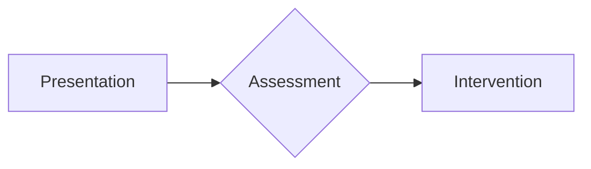

# SurgicalBrain — AI Synthesis & Serialization Guide

This guide explains how to generate medical synthesis notes that are compatible with the SurgicalBrain NoteTool serialization format. Use this guide to train custom AI skills (e.g., Surgical Synthesis Agent) or to create importable `.json` files. This document covers every feature of the NoteTool platform, including the data model, section types, visual diagram builder, export pipeline, annotation system, Connectome knowledge graph, and the full interactive UI.

---

## Table of Contents

1. [Metadata Schema (NoteData)](#1-metadata-schema-notedata)
2. [Section Types & Content Shapes](#2-section-types--content-shapes)
3. [Content Serialization Format (Markdown Import)](#3-content-serialization-format-markdown-import)
4. [Complete JSON Import File (Ready to Use)](#4-complete-json-import-file-ready-to-use)
5. [Batch Import Script](#5-batch-import-script)
6. [In-App Import Mechanism](#6-in-app-import-mechanism)
7. [Custom Skill Definition: Surgical Synthesis Agent](#7-custom-skill-definition-surgical-synthesis-agent)
8. [Mermaid Diagram Builder (MermaidMakerGUI)](#8-mermaid-diagram-builder-mermaidmakergui)
9. [Content Toolbar — Adding Sections In-App](#9-content-toolbar--adding-sections-in-app)
10. [Export Pipeline](#10-export-pipeline)
11. [Annotation System](#11-annotation-system)
12. [Connectome Knowledge Graph](#12-connectome-knowledge-graph)
13. [DDx Splitter — Differential Diagnosis Comparison](#13-ddx-splitter--differential-diagnosis-comparison)
14. [Dissection View & High-Yield Summaries](#14-dissection-view--high-yield-summaries)
15. [Mindmap View](#15-mindmap-view)
16. [Developer Mode](#16-developer-mode)
17. [PDF Workspace](#17-pdf-workspace)
18. [Home Screen & Dashboard](#18-home-screen--dashboard)
19. [Folders & Organization](#19-folders--organization)
20. [Settings & Configuration](#20-settings--configuration)
21. [Command Palette & Search](#21-command-palette--search)
22. [Theme System](#22-theme-system)
23. [Validation Rules & Best Practices](#23-validation-rules--best-practices)
24. [Store Architecture & Persistence](#24-store-architecture--persistence)
25. [Appendix A: Minimal Note Template](#appendix-a-minimal-note-template)
26. [Appendix B: Full Specialty Color Map](#appendix-b-full-specialty-color-map)
27. [Appendix C: Relation Types & Dash Patterns](#appendix-c-relation-types--dash-patterns)

---

## 1. Metadata Schema (NoteData)

Every note follows this internal TypeScript interface when serialized to JSON. This is the **authoritative schema** — all AI-generated notes must conform to it exactly.

```typescript
interface NoteData {
  id: string;                       // lowercase-kebab-case, e.g. 'community-acquired-pneumonia'
  title: string;                    // Human-readable title, e.g. 'Community-Acquired Pneumonia (CAP)'
  category: string;                 // e.g. 'Respiratory'
  specialty: string;                // e.g. 'Respiratory Medicine / Infectious Disease'
  summary: string;                  // One-line clinical summary (≤200 chars)
  icd10Codes: string[];             // ICD-10 codes, e.g. ['J15.9', 'J18.9']
  snomedCodes: string[];            // SNOMED CT concept IDs, e.g. ['58419007']
  tags: string[];                   // e.g. ['pneumonia', 'respiratory', 'antibiotics', 'emergency']
  folder?: string;                  // Optional folder assignment, e.g. 'Cardiology'
  sections: NoteSection[];          // Ordered content sections
  highYieldSummary: string[];       // Bullet points for Dissection View (≤120 chars each)
  links: NoteLink[];                // Connections to other notes (the Connectome)
  ddxComparison?: DdxRow[];         // Differential diagnosis comparison table
  createdAt: number;                // Unix timestamp (ms)
  updatedAt: number;                // Unix timestamp (ms)
}

interface NoteSection {
  id: string;                       // Unique section ID, e.g. 'cap-overview'
  title: string;                    // Section heading
  type: 'content' | 'mcq' | 'flashcard' | 'mermaid' | 'algorithm' | 'tabs' | 'asset' | 'pdf-embed';
  content: unknown;                 // Varies by type (see Section 2)
  dynamic?: boolean;                // true = user-added at runtime, shows remove/edit buttons in UI
}

interface NoteLink {
  targetId: string;                 // Target note ID (must match another note's `id`)
  relation: string;                 // e.g. 'differential-diagnosis', 'complication', 'management-pathway'
  label: string;                    // Display label, e.g. 'COPD Exacerbation', 'Sepsis'
}

interface DdxRow {
  feature: string;                  // e.g. 'Breath sound character'
  [key: string]: string;            // Dynamic keys: condition name → value
}
```

### Key Rules

- The `id` field must be unique across the entire store and follow `lowercase-kebab-case` format (only `a-z`, `0-9`, and `-`).
- The `sections` array is rendered **in order** — the first element appears at the top of the note. Sequence matters for clinical flow.
- The `dynamic` field on `NoteSection` is optional and only set to `true` when a section is added by the user at runtime (via the Content Toolbar). Dynamic sections show hover-reveal edit/delete buttons in the UI.
- The `links` array drives the Connectome knowledge graph. Each link must reference a valid `targetId` that corresponds to another note's `id` in the store.
- The `ddxComparison` table uses dynamic keys — each key after `feature` is the short name of a condition, and the value is how that condition presents for the given feature.
- Timestamps are Unix epoch milliseconds. Use `Date.now()` when generating notes programmatically.

---

## 2. Section Types & Content Shapes

Each section's `type` determines the shape of its `content` field. Below is the complete reference for every supported section type, with exact TypeScript interfaces and examples.

### A. Content (`type: 'content'`)

Plain markdown text with full GFM (GitHub Flavored Markdown) support. This is the most common section type for clinical text, definitions, epidemiology, treatment details, and any prose content.

```typescript
// content is a string (markdown)
{
  id: 'cap-overview',
  title: 'Overview & Definitions',
  type: 'content',
  content: '## Definition\n\nCommunity-Acquired Pneumonia (CAP) is an acute infection...'
}
```

**Markdown features supported:**
- Headings (`#`, `##`, `###`)
- Bold (`**text**`), italic (`*text*`), inline code (`` `code` ``)
- Ordered and unordered lists
- Tables (GFM syntax with `|` delimiters)
- Blockquotes (`> clinical pearl`)
- Images (``)
- Links (`[text](url)`)
- Fenced code blocks with language tags (including `mermaid` for inline diagrams)
- HTML `<div>` blocks with inline styles (for clinical pearls, callout boxes)

### B. MCQ (`type: 'mcq'`)

Multiple-choice question for active recall. Follows a "teaching not testing" philosophy — each question should have a detailed clinical vignette and a thorough explanation of why the correct answer is right and why distractors are wrong.

```typescript
interface MCQData {
  id: string;
  question: string;           // Clinical vignette, typically 2-4 sentences
  options: string[];          // 4-5 plausible options (can be up to 8 in the UI)
  correctIndex: number;       // 0-based index of the correct option
  explanation: string;        // Detailed teaching explanation
}

// Example
{
  id: 'cap-mcq-1',
  title: 'MCQ: Empiric Therapy Selection',
  type: 'mcq',
  content: {
    id: 'cap-mcq-1',
    question: 'A 55-year-old man with a 40-pack-year smoking history...',
    options: [
      'Amoxicillin 1g PO TDS alone',
      'Ceftriaxone 2g IV OD + Azithromycin 500mg IV OD',
      'Piperacillin-Tazobactam 4.5g IV Q6H + Ciprofloxacin 400mg IV BD',
      'Doxycycline 200mg PO OD alone',
      'Azithromycin 500mg PO OD alone'
    ],
    correctIndex: 1,
    explanation: 'This patient has severe CAP (CURB-65 = 3) requiring inpatient...'
  }
}
```

**MCQ Quality Rules:**
- Each question must have a clinical vignette with specific patient details (age, comorbidities, vitals, labs).
- Options must be plausible — avoid obviously wrong distractors.
- `correctIndex` must be a valid 0-based index within the `options` array.
- The explanation should teach the concept, not just state the correct answer. Explain why each wrong option is wrong.

### C. Flashcard (`type: 'flashcard'`')

Spaced-repetition flashcards for active recall. Supports cloze-deletion and image-occlusion formats.

```typescript
interface FlashcardData {
  id: string;
  type: 'cloze' | 'image-occlusion';
  front: string;              // Prompt — must contain ___ for cloze type
  back: string;               // Answer
  tags: string[];             // e.g. ['microbiology', 'pneumonia']
}

// Note: a flashcard section's content is an ARRAY of FlashcardData
{
  id: 'cap-flashcards',
  title: 'Flashcard Deck: CAP Essentials',
  type: 'flashcard',
  content: [
    { id: 'fc-1', type: 'cloze', front: 'The most common cause of CAP is ___ pneumoniae.', back: 'Streptococcus', tags: ['microbiology'] },
    { id: 'fc-2', type: 'cloze', front: 'CURB-65: Confusion, Urea >7, RR ≥___ , BP <90/60, Age ≥___', back: '30, 65', tags: ['severity-score'] },
  ]
}
```

**Flashcard Rules:**
- `cloze` type must contain `___` (3 underscores) as the blank marker in the `front` field.
- `image-occlusion` type is for labeling anatomical structures — the `front` is the prompt, and `back` is the label.
- Tags should use lowercase-kebab-case.

### D. Mermaid / Algorithm (`type: 'mermaid'` or `type: 'algorithm'`)

Flowchart or clinical algorithm rendered via Mermaid.js. The `algorithm` type is a semantic alias for `mermaid` — they use the same content shape and rendering, but `algorithm` signals a clinical decision tree.

```typescript
interface MermaidData {
  id: string;
  title: string;              // Display title shown above the diagram
  code: string;               // Valid Mermaid.js syntax
}

// Example
{
  id: 'cap-management',
  title: 'Management Algorithm',
  type: 'mermaid',
  content: {
    id: 'cap-algorithm',
    title: 'CAP Empiric Treatment Algorithm',
    code: 'graph TD\n  A[Confirmed CAP] --> B{CURB-65}\n  B -->|0-1| C[Outpatient]\n  B -->|3-5| D[Inpatient/ICU]'
  }
}
```

**Mermaid Configuration Used by NoteTool:**
- Theme: dark (with custom medical theme variables)
- `htmlLabels: false` — prevents black-box rendering artifacts on edge labels
- `curve: 'basis'` — smooth curved edges
- `padding: 20` — comfortable spacing around nodes
- Edge labels use transparent backgrounds (CSS override) to prevent opaque black rectangles

**Supported Mermaid Diagram Types:**
- `graph TD` / `graph LR` — flowcharts (most common for clinical algorithms)
- `sequenceDiagram` — for temporal clinical sequences
- `stateDiagram-v2` — for disease state transitions

**Testing Mermaid Code:** Always validate at [mermaid.live](https://mermaid.live) before embedding. Invalid syntax will cause rendering errors.

### E. Tabs (`type: 'tabs'`)

Tabbed content for organizing information into parallel categories (e.g., investigations split into Bedside / Laboratory / Imaging).

```typescript
interface TabData {
  tabs: {
    id: string;
    label: string;            // Tab label shown on the tab button
    content: string;          // Markdown content within the tab
  }[];
}

// Example
{
  id: 'cap-investigations',
  title: 'Investigations',
  type: 'tabs',
  content: {
    tabs: [
      { id: 'tab-bedside', label: 'Bedside', content: '- ECG: Look for ischemia\n- POCUS: Lung ultrasound' },
      { id: 'tab-lab', label: 'Laboratory', content: '- Troponin, NT-proBNP\n- CBC, CMP' },
      { id: 'tab-imaging', label: 'Advanced Imaging', content: '- CT Chest: if CXR non-diagnostic\n- Lung Ultrasound' }
    ]
  }
}
```

**Tab Rules:**
- Each tab's `label` must be unique within the section.
- Tab `content` is markdown text (same as `content` type).
- The first tab is active by default.

### F. Asset (`type: 'asset'`)

Embedded media (images, videos) with caption support. Assets can be uploaded as base64 data URLs or referenced by URL.

```typescript
interface AssetRef {
  id: string;
  noteId: string;             // ID of the parent note
  filename: string;           // Display filename
  type: 'image' | 'video';   // Media type
  caption: string;            // Caption displayed below the media
  url?: string;               // External URL (if referencing remote resource)
  path?: string;              // Internal path
  dataUrl?: string;           // Base64-encoded data URL (for uploaded files)
}

// Example (uploaded image)
{
  id: 'cap-xray',
  title: 'Chest X-Ray Findings',
  type: 'asset',
  content: {
    id: 'asset-1',
    noteId: 'community-acquired-pneumonia',
    filename: 'cap-xray-pa.jpg',
    type: 'image',
    caption: 'PA Chest X-Ray showing right lower lobe consolidation',
    url: 'data:image/jpeg;base64,/9j/4AAQ...'
  }
}
```

**Asset Rules:**
- When uploading via the Content Toolbar, the file is converted to a base64 data URL and stored in the `url` field.
- Images are rendered with `` tags; videos are rendered with `<video>` tags.
- Captions appear centered below the media element.

### G. PDF Embed (`type: 'pdf-embed'`)

Embedded PDF document stored as a base64 data URL. The PDF is rendered inline using an `<embed>` tag.

```typescript
interface PdfEmbedData {
  dataUrl: string;            // Base64 data URL of the PDF
  filename: string;           // Display filename
  noteId: string;             // ID of the parent note
}

// Example
{
  id: 'cap-guideline-pdf',
  title: 'ATS/IDSA Guidelines (PDF)',
  type: 'pdf-embed',
  content: {
    dataUrl: 'data:application/pdf;base64,JVBERi0xLjQ...',
    filename: 'ATS-IDSA-CAP-Guidelines-2019.pdf',
    noteId: 'community-acquired-pneumonia'
  }
}
```

**PDF Embed Rules:**
- PDFs are stored entirely as base64 within the note's JSON. Large PDFs will increase localStorage size significantly.
- In the HTML export, PDF embeds are rendered as `<embed>` elements with a header showing the filename.
- In print mode, PDF embeds are hidden with a note to open the HTML file to view them.

---

## 3. Content Serialization Format (Markdown Import)

When importing via the UI (paste note), the body is a sequence of sections separated by `<!-- section-break -->`.

### Section Header Syntax
```
## [type] Title
```

### Supported Section Types in Markdown

#### A. Content (`[content]`)
```markdown
## [content] Pathophysiology
The underlying mechanism involves increased filling pressures...


<div style="padding: 12px; background: rgba(240,165,0,0.1); border-left: 4px solid #f0a500;">
  <strong>Clinical Pearl:</strong> Always check for S3 gallop.
</div>
```

#### B. Tabs (`[tabs]`)
```markdown
## [tabs] Investigations
### Tab: Bedside
- ECG: Look for ischemia/arrhythmia
- POCUS: Lung ultrasound (B-lines)

### Tab: Laboratory
- Troponin, NT-proBNP
- CBC, CMP, coagulation profile
```

#### C. Algorithms (`[mermaid]`)
Use triple-backtick with `mermaid` language tag:
```markdown
## [mermaid] Treatment Algorithm

```

#### D. Active Recall (`[mcq]`)
```markdown
## [mcq] Management Priority
```mcq
{
  "question": "A patient with AHF has SBP 85 mmHg and cold peripheries. Next step?",
  "options": ["IV Furosemide", "Inotropic support", "Beta-blocker", "Fluid bolus"],
  "correctIndex": 1,
  "explanation": "Cold and Dry/Wet with hypotension requires inotropic support."
}
```
```

---

## 4. Complete JSON Import File (Ready to Use)

Below is a **complete, production-ready JSON file** for **Community-Acquired Pneumonia (CAP)**. This file can be imported directly via the app's import mechanism or loaded into localStorage. It demonstrates every section type and best practices for clinical content.

```json
{
  "id": "community-acquired-pneumonia",
  "title": "Community-Acquired Pneumonia (CAP)",
  "category": "Respiratory",
  "specialty": "Respiratory Medicine / Infectious Disease",
  "summary": "Acute infection of lung parenchyma acquired outside of healthcare settings. Caused primarily by Streptococcus pneumoniae, Haemophilus influenzae, and atypical organisms.",
  "folder": "Respiratory",
  "icd10Codes": ["J15.9", "J18.9", "J15.0", "J15.1"],
  "snomedCodes": ["58419007", "233604007", "53084003"],
  "tags": [
    "pneumonia",
    "respiratory",
    "antibiotics",
    "infectious-disease",
    "emergency",
    "curb-65",
    "chest-xray"
  ],
  "highYieldSummary": [
    "CAP = lung infection acquired outside healthcare settings",
    "Most common pathogen: Streptococcus pneumoniae",
    "Use CURB-65 score to determine inpatient vs outpatient",
    "Empiric Abx: Macrolide or Doxycycline for outpatients",
    "Inpatient: Beta-lactam + Macrolide (e.g., Ceftriaxone + Azithromycin)",
    "ICU: Beta-lactam + either Macrolide or Fluoroquinolone",
    "Duration: minimum 5 days (afebrile 48h + clinical stability)",
    "CXR shows lobar consolidation or interstitial infiltrates",
    "Key labs: WBC, CRP, Procalcitonin, Blood cultures x2",
    "Vaccination: PCV13/20 + PPSV23 + annual influenza"
  ],
  "links": [
    {
      "targetId": "acute-heart-failure",
      "relation": "differential-diagnosis",
      "label": "Acute Heart Failure (dyspnea mimic)"
    },
    {
      "targetId": "copd-exacerbation",
      "relation": "differential-diagnosis",
      "label": "COPD Exacerbation"
    },
    {
      "targetId": "sepsis-management",
      "relation": "complication",
      "label": "Sepsis & Septic Shock"
    },
    {
      "targetId": "pleural-effusion",
      "relation": "complication",
      "label": "Parapneumonic Effusion / Empyema"
    }
  ],
  "ddxComparison": [
    {
      "feature": "Onset",
      "CAP": "Acute (days)",
      "AHF": "Acute (hours)",
      "COPD Exacerbation": "Subacute (days)"
    },
    {
      "feature": "Fever",
      "CAP": "Common (>38.5°C)",
      "AHF": "Uncommon",
      "COPD Exacerbation": "Low-grade possible"
    },
    {
      "feature": "Sputum",
      "CAP": "Purulent, rusty",
      "AHF": "Pink frothy",
      "COPD Exacerbation": "Increased purulence"
    },
    {
      "feature": "CXR Pattern",
      "CAP": "Lobar consolidation",
      "AHF": "Interstitial edema, Kerley B",
      "COPD Exacerbation": "Hyperinflation, no infiltrate"
    },
    {
      "feature": "BNP",
      "CAP": "Normal-to-mild elevation",
      "AHF": "Elevated (>400 pg/mL)",
      "COPD Exacerbation": "Normal"
    }
  ],
  "sections": [
    {
      "id": "cap-overview",
      "title": "Overview & Definitions",
      "type": "content",
      "content": "## Definition\n\nCommunity-Acquired Pneumonia (CAP) is an acute infection of the lung parenchyma acquired outside of a hospital or long-term care facility. It remains a leading cause of morbidity and mortality worldwide.\n\n## Epidemiology\n- **Incidence**: ~5-10 cases per 1000 adults/year\n- **Mortality**: 5-15% (inpatient), 30-50% (ICU)\n- **Seasonal**: Peaks in winter months\n\n## Microbiology\n\n| Pathogen | Frequency | Typical Presentation |\n|----------|-----------|---------------------|\n| **Streptococcus pneumoniae** | 30-40% | Classic lobar pneumonia, rusty sputum |\n| **Haemophilus influenzae** | 10-15% | COPD patients, post-viral |\n| **Mycoplasma pneumoniae** | 10-20% | Young adults, dry cough, extrapulmonary |\n| **Chlamydophila pneumoniae** | 5-10% | Mild, biphasic illness |\n| **Legionella pneumophila** | 2-8% | Severe, multi-system (GI, CNS, electrolytes) |\n| **Staphylococcus aureus** | 3-5% | Post-influenza, cavitary lesions |\n| **Gram-negatives (Klebsiella, Pseudomonas)** | 5-10% | Alcoholism, comorbidities, healthcare contact |\n| **Viruses (Influenza, RSV, SARS-CoV-2)** | 15-25% | Biphasic illness, diffuse interstitial pattern |\n\n> **Clinical Pearl**: Atypical pathogens (Mycoplasma, Chlamydia, Legionella) do NOT respond to beta-lactams alone — always cover atypicals in empiric therapy."
    },
    {
      "id": "cap-clinical-features",
      "title": "Clinical Features & Risk Stratification",
      "type": "content",
      "content": "## Symptoms\n- **Cough** (90%) — initially dry, then productive\n- **Fever & rigors** (80%) — temperature >38.5°C\n- **Dyspnea** (70%) — correlates with severity\n- **Pleuritic chest pain** (50%) — indicates pleural involvement\n\n## CURB-65 Severity Score\n\n| Criteria | Point |\n|----------|-------|\n| **C**onfusion (new-onset, AMTS ≤8) | 1 |\n| **U**rea >7 mmol/L (BUN >20 mg/dL) | 1 |\n| **R**espiratory rate ≥30/min | 1 |\n| **B**lood pressure (SBP <90 OR DBP ≤60) | 1 |\n| Age ≥**65** | 1 |\n\n| Score | Risk Class | 30-day Mortality | Recommended Setting |\n|-------|-----------|-----------------|--------------------|\n| 0-1 | Low | <2% | Outpatient |\n| 2 | Moderate | 9% | Short-stay / Observation |\n| 3 | High | 22% | Inpatient / Medical ward |\n| 4-5 | Very High | 40-57% | ICU / High-dependency |"
    },
    {
      "id": "cap-investigations",
      "title": "Investigations",
      "type": "tabs",
      "content": {
        "tabs": [
          {
            "id": "tab-bedside",
            "label": "Bedside",
            "content": "- **Vital signs**: HR, BP, RR, SpO2, temperature\n- **Chest X-ray (PA + lateral)**: Required for diagnosis\n- **Arterial Blood Gas**: If SpO2 <92%\n- **ECG**: Rule out cardiac causes of dyspnea"
          },
          {
            "id": "tab-lab",
            "label": "Laboratory",
            "content": "- **CBC**: WBC elevated with left shift\n- **CRP**: Elevated, correlates with severity\n- **Procalcitonin**: >0.25 ng/mL suggests bacterial etiology\n- **Blood cultures ×2**: Before antibiotics\n- **Urinary antigen tests**: Legionella, S. pneumoniae"
          },
          {
            "id": "tab-imaging",
            "label": "Advanced Imaging",
            "content": "- **CT Chest**: If CXR non-diagnostic or suspected complications\n- **Lung Ultrasound**: Dynamic air bronchograms, subpleural consolidation"
          }
        ]
      }
    },
    {
      "id": "cap-management",
      "title": "Management Algorithm",
      "type": "mermaid",
      "content": {
        "id": "cap-algorithm",
        "title": "CAP Empiric Treatment Algorithm",
        "code": "graph TD\n  A[Confirmed CAP] --> B{CURB-65}\n  B -->|0-1: Outpatient| C[No comorbidities]\n  B -->|0-1: Outpatient| D[Comorbidities]\n  B -->|2: Observation| E[Medical Ward]\n  B -->|3-5: Inpatient/ICU| F{ICU Criteria?}\n  \n  C --> G[Amoxicillin 1g TDS OR Doxycycline]\n  D --> H[Co-amoxiclav + Macrolide]\n  E --> I[Ceftriaxone 2g OD + Azithromycin]\n  F -->|Yes| J[Beta-lactam + Macrolide OR Fluoroquinolone]\n  F -->|No| M[Ceftriaxone + Macrolide]\n  \n  style A fill:#f0a500,color:#0d1117\n  style B fill:#f0a500,color:#0d1117"
      }
    },
    {
      "id": "cap-mcq-1",
      "title": "MCQ: Empiric Therapy Selection",
      "type": "mcq",
      "content": {
        "id": "cap-mcq-1",
        "question": "A 55-year-old man with a 40-pack-year smoking history and known COPD presents with 4 days of fever (39.0°C), productive cough, and confusion. RR 32/min, BP 100/60, SpO2 88%. CXR shows left lower lobe consolidation. CURB-65 = 3. What is the most appropriate empiric antibiotic regimen?",
        "options": [
          "Amoxicillin 1g PO TDS alone",
          "Ceftriaxone 2g IV OD + Azithromycin 500mg IV OD",
          "Piperacillin-Tazobactam 4.5g IV Q6H + Ciprofloxacin 400mg IV BD",
          "Doxycycline 200mg PO OD alone",
          "Azithromycin 500mg PO OD alone"
        ],
        "correctIndex": 1,
        "explanation": "This patient has severe CAP (CURB-65 = 3) requiring inpatient admission. The recommended empiric regimen for severe non-ICU CAP is a beta-lactam + macrolide (Ceftriaxone + Azithromycin). Piperacillin-Tazobactam + Ciprofloxacin would be for ICU with Pseudomonas risk. Monotherapy is insufficient for severe CAP."
      }
    },
    {
      "id": "cap-flashcards",
      "title": "Flashcard Deck: CAP Essentials",
      "type": "flashcard",
      "content": [
        { "id": "fc-1", "type": "cloze", "front": "The most common cause of CAP is ___ pneumoniae.", "back": "Streptococcus", "tags": ["microbiology", "pneumonia"] },
        { "id": "fc-2", "type": "cloze", "front": "CURB-65: Confusion, Urea >7, RR ≥___ , BP <90/60, Age ≥___", "back": "30, 65", "tags": ["severity-score"] },
        { "id": "fc-3", "type": "cloze", "front": "The minimum duration of antibiotic therapy for CAP is ___ days.", "back": "5", "tags": ["treatment"] },
        { "id": "fc-4", "type": "cloze", "front": "Procalcitonin >___ ng/mL suggests bacterial etiology in CAP.", "back": "0.25", "tags": ["diagnostics"] }
      ]
    }
  ],
  "createdAt": 1746880000000,
  "updatedAt": 1746880000000
}
```

### How to Import

1. **Option A: localStorage injection** (dev/browser console):
   ```javascript
   const store = JSON.parse(localStorage.getItem('notetool-storage-v2') || '{}');
   store.state.notes = store.state.notes || [];
   store.state.notes.push(YOUR_NOTE_OBJECT);
   localStorage.setItem('notetool-storage-v2', JSON.stringify(store));
   location.reload();
   ```

2. **Option B: Via import script** (see Section 5)

3. **Option C: Via in-app import mechanism** (see Section 6)

---

## 5. Batch Import Script

Save as `batch-import.js` and run with Node.js:

```javascript
/**
 * SurgicalBrain NoteTool — Batch Import Script
 * 
 * Usage: node batch-import.js <directory-of-json-files>
 * 
 * This script reads all .json files from the specified directory,
 * validates them against the NoteData schema, and writes a single
 * importable JSON file that can be loaded into localStorage.
 */

const fs = require('fs');
const path = require('path');

const args = process.argv.slice(2);
const sourceDir = args[0] || './import-notes';

if (!fs.existsSync(sourceDir)) {
  console.error(`Directory not found: ${sourceDir}`);
  console.log(`Usage: node batch-import.js <directory-of-json-files>`);
  process.exit(1);
}

// ─── Validation Schema ──────────────────────────────────────────────

const REQUIRED_FIELDS = ['id', 'title', 'category', 'summary', 'sections', 'highYieldSummary'];
const VALID_SECTION_TYPES = ['content', 'mcq', 'flashcard', 'mermaid', 'algorithm', 'tabs', 'asset', 'pdf-embed'];

function validateNote(note, filename) {
  const errors = [];

  for (const field of REQUIRED_FIELDS) {
    if (note[field] === undefined || note[field] === null) {
      errors.push(`Missing required field: '${field}'`);
    }
  }

  if (note.id && !/^[a-z0-9-]+$/.test(note.id)) {
    errors.push(`Invalid 'id': must be lowercase-kebab-case (got '${note.id}')`);
  }

  if (Array.isArray(note.sections)) {
    note.sections.forEach((section, i) => {
      if (!section.id) errors.push(`Section [${i}] missing 'id'`);
      if (!section.title && section.title !== '') errors.push(`Section [${i}] missing 'title'`);
      if (!VALID_SECTION_TYPES.includes(section.type)) {
        errors.push(`Section [${i}] invalid type '${section.type}'. Valid: ${VALID_SECTION_TYPES.join(', ')}`);
      }
    });
  }

  if (note.createdAt && typeof note.createdAt !== 'number') errors.push(`'createdAt' must be a unix timestamp (number)`);
  if (note.updatedAt && typeof note.updatedAt !== 'number') errors.push(`'updatedAt' must be a unix timestamp (number)`);

  return errors;
}

// ─── Process Files ──────────────────────────────────────────────────

const files = fs.readdirSync(sourceDir).filter(f => f.endsWith('.json'));
const validNotes = [];
const errors = [];

console.log(`\nScanning ${sourceDir} for .json note files...\n`);

for (const file of files) {
  const filePath = path.join(sourceDir, file);
  try {
    const raw = fs.readFileSync(filePath, 'utf-8');
    const note = JSON.parse(raw);
    const validationErrors = validateNote(note, file);

    if (validationErrors.length > 0) {
      errors.push({ file, errors: validationErrors });
      console.log(`FAIL ${file} — ${validationErrors.length} validation error(s)`);
      validationErrors.forEach(e => console.log(`   - ${e}`));
    } else {
      validNotes.push(note);
      console.log(`OK   ${file} — "${note.title || note.id}"`);
    }
  } catch (err) {
    errors.push({ file, errors: [`Parse error: ${err.message}`] });
    console.log(`FAIL ${file} — Parse error: ${err.message}`);
  }
}

if (validNotes.length === 0) {
  console.log('\nNo valid notes found. Nothing to export.\n');
  process.exit(0);
}

const output = {
  _meta: {
    generator: 'SurgicalBrain Batch Import',
    generatedAt: Date.now(),
    totalFiles: files.length,
    validNotes: validNotes.length,
    errorCount: errors.length,
  },
  notes: validNotes,
};

const outputFile = path.join(process.cwd(), 'surgicalbrain-import.json');
fs.writeFileSync(outputFile, JSON.stringify(output, null, 2));
console.log(`\nGenerated import file: ${outputFile}`);
console.log(`Contains ${validNotes.length} note(s) ready for import.\n`);
```

### Usage

```bash
mkdir import-notes
# Place your .json files in import-notes/
node batch-import.js import-notes
# Output: surgicalbrain-import.json
```

---

## 6. In-App Import Mechanism

### Import Button (to add to the app)

Add this to any settings/import page:

```tsx
// ImportButton.tsx — Paste JSON to import a note
'use client';

import { useState } from 'react';
import { useNoteToolStore } from '@/stores/notetool-store';

export function ImportButton() {
  const [open, setOpen] = useState(false);
  const [jsonInput, setJsonInput] = useState('');
  const [feedback, setFeedback] = useState('');
  const addNote = useNoteToolStore((s) => s.addNote);

  const handleImport = () => {
    try {
      const parsed = JSON.parse(jsonInput);
      const notesToImport = parsed.notes || [parsed];

      let imported = 0;
      for (const note of notesToImport) {
        if (note.id && note.title && note.sections) {
          addNote(note);
          imported++;
        }
      }

      setFeedback(`Imported ${imported} note(s) successfully`);
      setJsonInput('');
    } catch (err) {
      setFeedback(`Error: ${(err as Error).message}`);
    }
  };

  return (
    <div>
      <button onClick={() => setOpen(true)} className="...">
        Import Note (JSON)
      </button>
      {open && (
        <div className="fixed inset-0 z-50 bg-black/50 flex items-center justify-center">
          <div className="bg-sb-surface w-[600px] rounded-xl p-6 border border-sb-border">
            <h2 className="text-lg font-semibold mb-4">Import SurgicalBrain Note</h2>
            <textarea
              className="w-full h-64 bg-sb-bg border border-sb-border rounded-lg p-3 text-sm font-mono"
              placeholder="Paste JSON here..."
              value={jsonInput}
              onChange={(e) => setJsonInput(e.target.value)}
            />
            <div className="flex gap-3 mt-4 justify-end">
              <button onClick={() => setOpen(false)} className="px-4 py-2 text-sb-muted">Cancel</button>
              <button onClick={handleImport} className="px-4 py-2 bg-sb-accent text-sb-bg rounded-lg">Import</button>
            </div>
            {feedback && <p className="mt-3 text-sm">{feedback}</p>}
          </div>
        </div>
      )}
    </div>
  );
}
```

---

## 7. Custom Skill Definition: Surgical Synthesis Agent

When acting as a **Surgical Synthesis Agent**, follow these rules precisely to generate notes that integrate seamlessly with the NoteTool platform.

### Persona: "The Surgeon's Mind"

- **Dissect**: Break topics into `[content]`, `[tabs]`, `[mermaid]`, and `[mcq]` sections using the recommended note structure.
- **Map**: Use note links `{ targetId, relation, label }` to connect concepts across notes in the Connectome knowledge graph.
- **Act**: Prioritize active recall (MCQ, flashcards) over passive reading — every note should have at least 3 MCQs and 4 flashcards.
- **Connect**: Tag with ICD-10/SNOMED codes and assign to the appropriate `folder` for organizational clarity.

### Mandatory Rules for Skill Execution

1. **Serialization**: Always use the JSON schema above with proper `sections[]` array. Each section must have `id`, `title`, `type`, and `content`.

2. **ID Format**: `lowercase-kebab-case` — e.g., `acute-heart-failure`, `community-acquired-pneumonia`. No spaces, no uppercase, no special characters.

3. **MCQ Quality**: Each MCQ must have a clinical vignette (specific patient demographics, vitals, lab values), 4-5 plausible options, and a detailed explanation following the "teaching not testing" principle. The explanation should explain why the correct answer is correct AND why each wrong answer is wrong.

4. **High-Yield Summaries**: Each bullet must be ≤120 chars, self-contained, actionable, with specific numbers where relevant. No forward references. No vague statements.

5. **DDx Tables**: Always include discriminating features — what makes each diagnosis *distinct*, not just listing shared symptoms. Include at least 4-5 features with 2-3 comparison conditions.

6. **Links**: Create meaningful Connectome connections with specific `relation` types. Valid relation types include: `differential-diagnosis`, `complication`, `management-pathway`, `etiology`, `comorbidity`, `continuum`, `common-trigger`, `indication`, `perioperative-risk`. Each link's `targetId` should reference a note that exists or will be created.

7. **No Placeholders**: Generate full, clinical-grade content. No "coming soon", "placeholder", "TBD", or "example" text. Every section must contain complete, actionable medical knowledge.

8. **Timestamps**: Use `Date.now()` in milliseconds for `createdAt` and `updatedAt`.

9. **Mermaid Diagrams**: All Mermaid code must be valid and tested. Use `graph TD` for top-down clinical algorithms. Use `style` directives to highlight key nodes (e.g., `style A fill:#f0a500,color:#0d1117` for the entry point).

10. **Section Ordering**: Follow the recommended note structure below for clinical flow.

### Recommended Note Structure

1. **Overview & Definitions** (`content`) — Definition, epidemiology, microbiology/pathophysiology
2. **Clinical Features** (`content` or `tabs`) — Symptoms, signs, physical exam findings
3. **Classification / Severity Scoring** (`content`) — Scoring systems with tables
4. **Investigations** (`tabs`: Bedside / Laboratory / Advanced Imaging) — Organized by setting
5. **Management Algorithm** (`mermaid`) — Visual flowchart with style directives
6. **Pharmacotherapy** (`content`) — Drug names, doses, durations, side effects
7. **MCQ x 3-5** (`mcq`) — Distributed after relevant content sections
8. **Flashcard Deck** (`flashcard`) — 4-6 cloze-deletion cards covering high-yield facts
9. **Complications** (`content`) — Table with frequency and management
10. **Prevention** (`content`) — Vaccination, risk factor modification

### Specialty-to-Folder Mapping

When generating notes, assign the `folder` field based on the note's primary specialty:

| Specialty | Folder |
|-----------|--------|
| Cardiology | Cardiology |
| Respiratory Medicine | Respiratory |
| Nephrology | Nephrology |
| General Surgery | Surgery |
| Emergency Medicine | Emergency |
| Neurology | Neurology |
| Gastroenterology | Gastroenterology |
| Endocrinology | Endocrinology |
| Infectious Disease | Emergency |
| Hematology | Hematology |
| Oncology | Oncology |

---

## 8. Mermaid Diagram Builder (MermaidMakerGUI)

The NoteTool includes a visual flowchart builder that generates Mermaid code from an interactive step-based interface. This is accessible via the Content Toolbar's "Diagram Builder" button.

### Data Model

```typescript
type StepKind = 'start' | 'process' | 'decision' | 'milestone' | 'end';

interface FlowStep {
  id: string;
  kind: StepKind;
  label: string;
  branches: Branch[];         // For decisions: outgoing branches
  nextId: string | null;      // ID of the next step in main flow
}

interface Branch {
  id: string;
  label: string;              // e.g. "Yes", "Abnormal", "High Risk"
  targetId: string | null;    // null = not connected yet
}
```

### Step Kind Configuration

| Kind | Label | Medical Term | Mermaid Shape | Color |
|------|-------|-------------|---------------|-------|
| `start` | Start | Entry Point | `(...)` rounded | Emerald |
| `process` | Process | Action / Step | `[...]` rectangle | Blue |
| `decision` | Decision | If / Branch | `{...}` diamond | Amber |
| `milestone` | Milestone | Checkpoint | `([...])` stadium | Violet |
| `end` | End | Outcome | `(...)` rounded | Rose |

### Presets

The builder includes three quick-start presets that pre-populate the flow with common clinical patterns:

1. **Clinical Pathway** — A risk-stratified pathway with high/low branches converging on re-evaluation
2. **Decision Tree** — A diagnostic algorithm with lab/imaging decision points
3. **Protocol** — A sequential treatment protocol with a response decision and escalation loop

### Code Generation

The `stepsToMermaid()` function converts the flow step array into valid Mermaid `graph TD` syntax:

```typescript
function stepsToMermaid(steps: FlowStep[]): string {
  const lines: string[] = ['graph TD'];
  // 1. Emit node declarations with shape syntax
  // 2. Emit main-flow edges (step.nextId)
  // 3. Emit decision branch edges with labels
  // 4. Handle unconnected decisions via fallback
  return lines.join('\n');
}
```

### UI Features

- **Inline editing**: Click any step label to edit it in-place
- **Insert between**: Hover between two steps to reveal insert buttons for each step kind
- **Branch management**: Decision steps show branch labels with connect/disconnect controls; up to 5 branches per decision
- **Live preview**: Right panel shows real-time Mermaid rendering with zoom controls
- **Generated syntax**: Bottom panel shows the raw Mermaid code for manual editing
- **Scrollable sidebar**: The step list scrolls independently from the preview

### Integration

When saving, the builder calls `onSave({ code, title })` which creates a `NoteSection` of type `mermaid` with the generated code:

```typescript
const section: NoteSection = {
  id: generateId(),
  type: 'mermaid',
  title: data.title || 'Flowchart',
  content: { id: generateId(), title: data.title || 'Flowchart', code: data.code.trim() },
  dynamic: true,
};
addSectionToNote(activeNoteId, section);
```

---

## 9. Content Toolbar — Adding Sections In-App

The Content Toolbar provides seven tools for adding sections to the active note at runtime. Each tool opens a dialog with a form specific to the section type.

### Available Tools

| Tool | Section Type | Icon | Color | Description |
|------|-------------|------|-------|-------------|
| Add Section | `content` | FileText | Teal | Markdown content with title |
| Add MCQ | `mcq` | HelpCircle | Amber | Clinical vignette with options and explanation |
| Add Flashcard | `flashcard` | Layers | Violet | Cloze or image-occlusion flashcard |
| Diagram Builder | `mermaid` | Activity | Blue | Opens MermaidMakerGUI (full-screen) |
| Add Tab Group | `tabs` | Columns3 | Rose | Comma-separated tab names with auto-generated IDs |
| Add Asset | `asset` | ImagePlus | Emerald | Image/video upload or URL |
| Embed PDF | `pdf-embed` | FileUp | Orange | PDF file upload as base64 |

### Form Details

**MCQ Form:**
- Question textarea (3 rows)
- Options A-E with add/remove (2-8 options supported)
- Correct answer selector (dropdown)
- Explanation textarea (4 rows)

**Flashcard Form:**
- Type selector: Cloze Deletion or Image Occlusion
- Front (prompt) textarea
- Back (answer) input
- Tags (comma-separated)

**Asset Form:**
- Title/caption input
- Type selector: Image or Video
- Source tabs: Upload (file picker with preview) or URL
- File is converted to base64 data URL on upload

**PDF Embed Form:**
- File upload with drag-and-drop area
- PDF is stored as base64 data URL

All sections created via the Content Toolbar have `dynamic: true`, which enables hover-reveal edit and delete buttons in the note view.

---

## 10. Export Pipeline

The NoteTool supports four export formats, all accessible from the export dropdown in the note header.

### A. JSON Export

Exports the full `NoteData` object as pretty-printed JSON. This is the complete serialization including all sections, links, metadata, and timestamps.

```typescript
content = JSON.stringify(note, null, 2);
filename = `${note.id}.json`;
mimeType = 'application/json';
```

### B. HTML Export

Generates a standalone HTML document with embedded CSS, medical typography, and Mermaid.js CDN for diagram rendering. The HTML export is designed to be readable without any server — it opens directly in any browser.

**Key Features:**
- Medical-serif headings (Georgia, Times New Roman)
- Amber accent color scheme matching the app theme
- Dark/light theme-aware (uses current theme setting)
- Mermaid diagrams rendered client-side via CDN (`mermaid@11`)
- Images embedded as base64 data URLs (no external dependencies)
- PDF embeds rendered as `<embed>` elements
- Print stylesheet with `break-inside: avoid` for all block elements
- MCQ correct answers highlighted with green border
- Flashcards rendered as front/back card pairs
- Tabs rendered as stacked sections with accent-colored headers

**Mermaid Rendering in HTML Export:**
- If the note contains any `mermaid` or `algorithm` sections, the Mermaid.js CDN script is included
- Mermaid code is placed inside `<div class="mermaid">` elements
- A `<noscript>` fallback shows the raw Mermaid code if JavaScript is disabled
- Mermaid is initialized with `startOnLoad: true` and the appropriate theme (`dark` or `default`)
- Theme variables are set to match the NoteTool's medical color scheme

```typescript
// Mermaid initialization in exported HTML
mermaid.initialize({
  startOnLoad: true,
  theme: 'dark',  // or 'default' for light theme
  themeVariables: {
    primaryColor: '#1e3a5f',
    primaryTextColor: '#e2e8f0',
    primaryBorderColor: '#2563eb',
    lineColor: '#64748b',
    fontSize: '14px',
    edgeLabelBackground: 'transparent',
  },
  flowchart: { curve: 'basis', htmlLabels: false, padding: 20 }
});
```

### C. PDF Export

The PDF export uses the same HTML generation pipeline as the HTML export, but configured for print (`forPrint: true`). This produces a white-background, print-optimized document:

**Print-Optimized Settings:**
- Background: `#ffffff` (white)
- Text: `#1c1917` (near-black)
- Muted text: `#666666`
- Accent: `#c27803` (darker amber for print visibility)
- Borders: `#d0d0d0` (subtle gray)
- Correct answer highlight: `#16a34a` (green)

**Export Flow:**
1. Generate print-optimized HTML via `generateExportHtml(note, true)`
2. Create a Blob and open in a new browser window
3. Wait for Mermaid to render (2-second delay if diagrams exist, 300ms otherwise)
4. Auto-trigger `window.print()` for the browser's native PDF dialog
5. If the popup is blocked, fall back to downloading the HTML file

### D. Anki Export (CSV)

Exports flashcards and MCQs as a CSV file compatible with Anki's "Import from CSV" feature.

**Conversion Rules:**
- Flashcard sections: `front` → Front, `back` → Back, `tags` → Tags
- MCQ sections: Question + all options → Front, Correct answer + explanation → Back, `['mcq', specialty]` → Tags
- CSV format: `"Front","Back","Tags"` with proper escaping for commas, quotes, and newlines

```typescript
// CSV escape for Anki compatibility
const escapeCsv = (val: string) => {
  if (val.includes('"') || val.includes(',') || val.includes('\n')) {
    return `"${val.replace(/"/g, '""')}"`;
  }
  return val;
};
```

---

## 11. Annotation System

The NoteTool includes a comprehensive annotation system with three layers: per-note annotations, global annotation overlay, and annotation canvas tools.

### Per-Note Annotations

Annotations are stored per-note and automatically saved/restored when switching between notes:

```typescript
interface NoteAnnotations {
  stickyNotes: StickyNote[];
  highlightRegions: HighlightRegion[];
  drawingPaths: DrawingPath[];
}

interface StickyNote {
  id: string;
  x: number;
  y: number;
  text: string;
  color: string;
  timestamp: number;
}

interface HighlightRegion {
  id: string;
  text: string;
  color: string;
  rangeInfo: {
    startContainerPath: string;
    startOffset: number;
    endContainerPath: string;
    endOffset: number;
  };
  rect: HighlightRect;
  rects: HighlightRect[];
}

interface DrawingPath {
  id: string;
  points: { x: number; y: number }[];
  color: string;
  strokeWidth: number;
}
```

### Global Pen Overlay

The global annotation overlay provides system-wide annotation tools:

| Tool | Description | Cursor |
|------|-------------|--------|
| `pen` | Freehand drawing | Crosshair |
| `highlight-text` | Text highlight selection | Text cursor |
| `highlight-free` | Freeform highlight rectangle | Crosshair |
| `sticky` | Place sticky notes | Click to place |
| `eraser` | Remove annotations | Eraser cursor |
| `pan` | Pan the view | Grab/Grabbing |

### Annotation Persistence

Annotations are persisted in the store under `annotationsPerNote: Record<string, NoteAnnotations>`. When the user switches to a different note, the current annotations are saved and the new note's annotations are loaded:

```typescript
// Auto-save/restore on note switch
setActiveNoteId: (id) => {
  const state = get();
  const currentAnnotations = {
    stickyNotes: state.stickyNotes,
    highlightRegions: state.highlightRegions,
    drawingPaths: state.drawingPaths,
  };
  set((s) => ({
    activeNoteId: id,
    annotationsPerNote: {
      ...s.annotationsPerNote,
      [s.activeNoteId]: currentAnnotations,
    },
    stickyNotes: s.annotationsPerNote[id]?.stickyNotes || [],
    highlightRegions: s.annotationsPerNote[id]?.highlightRegions || [],
    drawingPaths: s.annotationsPerNote[id]?.drawingPaths || [],
  }));
}
```

---

## 12. Connectome Knowledge Graph

The Connectome is a D3.js-powered knowledge graph that visualizes relationships between notes. It reads the `links` array from the active note and renders a force-directed or radial layout.

### Features

- **Force-directed layout**: D3 force simulation with charge, center, collision, and link forces
- **Radial layout**: Center node in the middle, connected nodes arranged in a circle
- **Specialty-based node coloring**: Each medical specialty has a unique color scheme (fill, stroke, text, glow)
- **Animated edges**: Dash patterns that animate along the path direction, with colors specific to the relation type
- **Interactive editing**: Add nodes, add links between nodes, delete nodes/links
- **Zoom and pan**: D3 zoom behavior with scale extent [0.3, 3]
- **Fullscreen mode**: Expand the Connectome to fill the entire viewport
- **Tooltips**: Hover over nodes to see the note ID and specialty
- **Link labels**: Hover over edges to see the relationship label and type

### Specialty Color Map

See [Appendix B](#appendix-b-full-specialty-color-map) for the complete color map. Colors are defined with four properties:

- `fill`: Node background color
- `stroke`: Node border color
- `text`: Label text color
- `glow`: Drop shadow color (used for center node glow effect)

### Relation Dash Patterns

See [Appendix C](#appendix-c-relation-types--dash-patterns) for the complete mapping of relation types to dash patterns and colors.

### Auto-Specialty Detection

When a new node is added, the Connectome guesses its specialty based on keywords in the node ID:

```typescript
const SPECIALTY_KEYWORDS: [string, string][] = [
  ['heart', 'Cardiology'], ['cardiac', 'Cardiology'], ['hf', 'Cardiology'],
  ['copd', 'Respiratory Medicine'], ['pneumonia', 'Respiratory Medicine'],
  ['aki', 'Nephrology'], ['renal', 'Nephrology'], ['kidney', 'Nephrology'],
  ['chole', 'General Surgery'], ['surgery', 'General Surgery'],
  ['stroke', 'Neurology'], ['seizure', 'Neurology'],
  ['diabetes', 'Endocrinology'], ['thyroid', 'Endocrinology'],
  ['sepsis', 'InfectiousDisease'],
  // ... and more
];
```

---

## 13. DDx Splitter — Differential Diagnosis Comparison

The DDx Splitter provides a side-by-side comparison of two notes' differential diagnosis data. It uses the `ddxComparison` table from each note and renders them in a split-panel view.

**Key Features:**
- Left and right note selectors (dropdown)
- Shared feature column with condition-specific comparison columns
- Highlighted differences for easy visual scanning
- The `ddxComparison` table format uses dynamic keys where each key is a condition short name

---

## 14. Dissection View & High-Yield Summaries

The Dissection View renders the `highYieldSummary` array as a list of compact, high-impact bullet points. This is designed for rapid review and spaced repetition.

**Rules for high-yield summaries:**
- Maximum 120 characters per bullet
- Must be self-contained (no "as mentioned above" or forward references)
- Should include specific numbers, drug names, or thresholds where relevant
- Minimum 3 bullets per note (recommended: 8-12)

---

## 15. Mindmap View

The Mindmap View auto-generates a hierarchical mind map from the note's section titles. It uses the `markmap` library to render an interactive, collapsible tree structure.

**Generation Logic:**
```typescript
const mindmapMarkdown = `# ${activeNote.title}\n` +
  activeNote.sections.map((s) => `## ${s.title}`).join('\n');
```

The root node is the note title, and each section becomes a second-level branch. The mindmap supports zoom, pan, and click-to-expand/collapse.

---

## 16. Developer Mode

Developer Mode (`mode: 'developer'`) provides a split-panel interface for editing custom HTML/JS that renders in the note view. The left panel is a code editor, and the right panel shows a live preview.

**Key Features:**
- HTML/JS code editor with syntax highlighting
- Live preview panel that updates on change
- Access to all CSS variables (`var(--color-sb-*)`) for consistent styling
- Can create interactive elements (tables, charts, custom visualizations)

---

## 17. PDF Workspace

The PDF Workspace allows users to upload PDF files for viewing and annotation. It's accessible from the sidebar's "PDF Workspace" view.

**Key Features:**
- Drag-and-drop PDF upload
- PDF rendering via `<iframe>` with `URL.createObjectURL`
- Page navigation
- PDFs can also be embedded directly into notes via the Content Toolbar's "Embed PDF" button

---

## 18. Home Screen & Dashboard

The Home Screen is the default landing page (`activeView: 'home'`) with four sections:

### Stats Dashboard
- Total Syntheses (note count)
- Specialties (unique specialty count)
- Flashcards (total flashcard count across all notes)
- MCQs (total MCQ count across all notes)

### Quick Actions
- **Create New Synthesis** — Opens the New Note Modal
- **Open Library** — Switches to the Library view
- **Upload PDF** — Switches to the PDF Workspace

### Recent Activity
- Shows the 4 most recently updated notes (sorted by `updatedAt` descending)
- Click to navigate to the note

### Getting Started
- Step 1: Create a Synthesis
- Step 2: Use Three Modes (Read, Annotate, Developer)
- Step 3: Explore the Connectome
- Step 4: Active Recall Practice (flashcards, MCQs, Anki export)

---

## 19. Folders & Organization

The NoteTool supports a folder-based organization system for notes.

### Folder Operations

| Operation | Method | Description |
|-----------|--------|-------------|
| Create | `addFolder(name)` | Adds a new folder (deduplicates) |
| Rename | `renameFolder(oldName, newName)` | Renames folder and updates all notes in it |
| Delete | `deleteFolder(name, deleteNotes?)` | Removes folder; optionally deletes all notes in it |
| Move Note | `moveNoteToFolder(noteId, folderName)` | Assigns a note to a folder |

### Default Folders
- Cardiology
- Surgery
- Nephrology
- Emergency

### Folder Assignment

Notes are assigned to folders via the `folder` field in `NoteData`. When a folder is renamed, all notes in that folder are automatically updated. When a folder is deleted without the `deleteNotes` flag, notes are moved to the root (empty folder string).

---

## 20. Settings & Configuration

The app settings are stored in the persisted store and include:

```typescript
interface AppSettings {
  autoDissect: boolean;                  // Auto-enable dissection view
  connectomeSync: boolean;               // Sync Connectome with note links
  fontSize: number;                      // Base font size (default: 15)
  theme: 'dark' | 'light';              // Theme selection
  annotationToolbarPosition: 'top' | 'bottom' | 'left' | 'right';  // Toolbar placement
}
```

### User Profile

```typescript
interface UserProfile {
  name: string;          // e.g. 'Dr. Surgeon'
  specialty: string;     // e.g. 'Cardiology'
  institution: string;   // e.g. 'General Hospital'
  avatar: string;        // Avatar URL or base64
}
```

---

## 21. Command Palette & Search

The Command Palette provides quick navigation across all notes. It's triggered by `Cmd+K` (macOS) or `Ctrl+K` (Windows/Linux).

**Features:**
- Fuzzy search across note title, specialty, category, and tags
- Arrow key navigation (up/down) with Enter to select
- Escape to close
- Auto-focus on open
- The filtered results update in real-time as the user types

**Search Logic:**
```typescript
const filteredNotes = searchQuery.trim()
  ? notes.filter((n) => {
      const q = searchQuery.toLowerCase();
      return (
        n.title.toLowerCase().includes(q) ||
        n.specialty.toLowerCase().includes(q) ||
        n.category.toLowerCase().includes(q) ||
        n.tags.some((t) => t.toLowerCase().includes(q))
      );
    })
  : notes;
```

---

## 22. Theme System

The NoteTool supports dark and light themes, controlled by `settings.theme`. The theme affects:

### Color Tokens

| Token | Dark | Light |
|-------|------|-------|
| Background | `#0d1117` | `#f3f0eb` |
| Surface | `#161b22` | `#ffffff` |
| Surface2 | `#1c2330` | `#f8f6f1` |
| Text | `#e6edf3` | `#1c1917` |
| Muted | `#8b949e` | `#78716c` |
| Accent | `#f0a500` | `#c27803` |
| Border | `#30363d` | `#d0ccc5` |

### Export Theme Behavior

- **HTML Export**: Uses the current theme colors for inline CSS
- **PDF Export**: Always uses light theme colors for print optimization
- **Mermaid Diagrams**: Theme-aware initialization (`dark` or `default`)

---

## 23. Validation Rules & Best Practices

### Required Fields

| Field | Type | Required | Notes |
|-------|------|----------|-------|
| `id` | `string` | Yes | lowercase-kebab-case, unique across store |
| `title` | `string` | Yes | Human-readable |
| `category` | `string` | Yes | Medical category |
| `summary` | `string` | Yes | ≤200 characters |
| `sections` | `NoteSection[]` | Yes | ≥1 section, ordered |
| `highYieldSummary` | `string[]` | Yes | ≥3 bullets |
| `createdAt` | `number` | Yes | Unix timestamp (ms) |
| `updatedAt` | `number` | Yes | Unix timestamp (ms) |

### Strongly Recommended Fields

| Field | Type | Notes |
|-------|------|-------|
| `icd10Codes` | `string[]` | At least 1 code |
| `snomedCodes` | `string[]` | At least 1 concept ID |
| `tags` | `string[]` | 3-10 tags, lowercase-kebab-case |
| `links` | `NoteLink[]` | Connect to related notes |
| `ddxComparison` | `DdxRow[]` | For differential diagnosis notes |
| `folder` | `string` | Organizational folder |
| `specialty` | `string` | Full specialty name |

### Validation Rules

1. **No duplicate IDs**: Each note's `id` must be unique across the entire store. The `addNote` method filters duplicates before inserting.
2. **Section order matters**: Sections are rendered in array order.
3. **MCQ options**: 4-5 options recommended (2-8 supported). `correctIndex` must be 0-based and within range.
4. **Flashcards**: `cloze` type must contain `___` (3 underscores) as the blank marker.
5. **Mermaid code**: Must be valid Mermaid.js syntax. Test at [mermaid.live](https://mermaid.live) before embedding.
6. **Tab labels**: Each tab in a `tabs` section must have a unique `label` within that section.
7. **High-yield bullets**: Max 120 characters each. Must be self-contained (no forward references).
8. **Tags**: Use lowercase-kebab-case. Common tags: `emergency`, `cardiology`, `pharmacology`, `surgery`, `pediatrics`, `diagnostics`.
9. **Dynamic sections**: Sections added at runtime have `dynamic: true`. This is informational — it enables the edit/delete hover buttons in the UI but does not affect content rendering.

---

## 24. Store Architecture & Persistence

The NoteTool uses Zustand with the `persist` middleware for state management. The store is persisted to `localStorage` under the key `notetool-storage-v2`.

### Persisted State

Only the following fields are persisted (via `partialize`):

```typescript
partialize: (state) => ({
  notes: state.notes,
  folders: state.folders,
  userProfile: state.userProfile,
  settings: state.settings,
  activeNoteId: state.activeNoteId,
  annotationsPerNote: state.annotationsPerNote,
  sidebarOpen: state.sidebarOpen,
  mcqAnswers: state.mcqAnswers,
  flashcardStates: state.flashcardStates,
})
```

### Ephemeral State

The following state is NOT persisted and resets on page reload:
- `mode` (read/annotate/developer)
- `activeView` (home/notes/library/connectome/etc.)
- `dissectionMode`
- `globalPenActive`, `globalPenTool`
- `highlightColor`, `drawingColor`, `drawingBrushSize`
- `stickyNotes`, `highlightRegions`, `drawingPaths` (loaded from `annotationsPerNote`)
- `contentToolbarOpen`
- `searchOpen`, `searchQuery`
- `fullscreenView`, `fullscreenMermaidCode`
- `pdfFile`, `pdfPageNum`
- All modal open states

### App Modes

```typescript
type AppMode = 'read' | 'annotate' | 'developer';
```

- **Read**: Default mode. Content is displayed with interactive MCQ/flashcard blocks.
- **Annotate**: Activates the global pen overlay. Sections show edit buttons on hover.
- **Developer**: Shows the HTML/JS code editor with live preview.

### View Panels

```typescript
type ViewPanel = 'home' | 'notes' | 'library' | 'connectome' | 'ddx' | 'mindmap' | 'pdf-workspace';
```

---

## Appendix A: Minimal Note Template

```json
{
  "id": "your-note-id",
  "title": "Your Note Title",
  "category": "Category",
  "specialty": "Specialty",
  "summary": "One-line summary of the condition.",
  "icd10Codes": ["XXX.XX"],
  "snomedCodes": ["00000000"],
  "tags": ["tag1", "tag2", "tag3"],
  "folder": "Folder Name",
  "highYieldSummary": [
    "First high-yield point with specific data",
    "Second high-yield point with a threshold value",
    "Third high-yield point with a drug name"
  ],
  "links": [
    {
      "targetId": "related-note-id",
      "relation": "differential-diagnosis",
      "label": "Related Condition"
    }
  ],
  "ddxComparison": [
    {
      "feature": "Key discriminating feature",
      "This Condition": "Specific presentation",
      "Alternative Dx": "Different presentation"
    }
  ],
  "sections": [
    {
      "id": "section-1",
      "title": "Overview",
      "type": "content",
      "content": "## Definition\n\nDefinition text here.\n\n## Epidemiology\n- Statistic 1\n- Statistic 2"
    },
    {
      "id": "section-2",
      "title": "Investigations",
      "type": "tabs",
      "content": {
        "tabs": [
          { "id": "tab-1", "label": "Bedside", "content": "- Finding 1\n- Finding 2" },
          { "id": "tab-2", "label": "Laboratory", "content": "- Lab 1\n- Lab 2" }
        ]
      }
    },
    {
      "id": "section-3",
      "title": "Management Algorithm",
      "type": "mermaid",
      "content": {
        "id": "algo-1",
        "title": "Treatment Algorithm",
        "code": "graph TD\n  A[Presentation] --> B{Assessment}\n  B -->|Low Risk| C[Outpatient]\n  B -->|High Risk| D[Inpatient]\n  style A fill:#f0a500,color:#0d1117"
      }
    },
    {
      "id": "section-4",
      "title": "Active Recall",
      "type": "mcq",
      "content": {
        "id": "mcq-1",
        "question": "Clinical vignette with specific patient details?",
        "options": ["Option A", "Option B", "Option C", "Option D"],
        "correctIndex": 0,
        "explanation": "Detailed teaching explanation covering why the correct answer is right and why each distractor is wrong."
      }
    },
    {
      "id": "section-5",
      "title": "Key Facts",
      "type": "flashcard",
      "content": [
        { "id": "fc-1", "type": "cloze", "front": "Key fact with ___ blank", "back": "Answer", "tags": ["tag1"] }
      ]
    }
  ],
  "createdAt": 1746880000000,
  "updatedAt": 1746880000000
}
```

---

## Appendix B: Full Specialty Color Map

Colors used in the Connectome for each medical specialty:

| Specialty | Fill | Stroke | Text | Glow |
|-----------|------|--------|------|------|
| Cardiology | `#9f1239` | `#f43f5e` | `#fda4af` | `rgba(244,63,94,0.4)` |
| Respiratory Medicine | `#0c4a6e` | `#0ea5e9` | `#7dd3fc` | `rgba(14,165,233,0.4)` |
| Nephrology | `#064e3b` | `#10b981` | `#6ee7b7` | `rgba(16,185,129,0.4)` |
| General Surgery | `#713f12` | `#f59e0b` | `#fcd34d` | `rgba(245,158,11,0.4)` |
| Neurology | `#581c87` | `#a855f7` | `#d8b4fe` | `rgba(168,85,247,0.4)` |
| Gastroenterology | `#7c2d12` | `#f97316` | `#fdba74` | `rgba(249,115,22,0.4)` |
| Endocrinology | `#134e4a` | `#14b8a6` | `#5eead4` | `rgba(20,184,166,0.4)` |
| InfectiousDisease | `#4a1d96` | `#8b5cf6` | `#c4b5fd` | `rgba(139,92,246,0.4)` |
| Hematology | `#7f1d1d` | `#ef4444` | `#fca5a5` | `rgba(239,68,68,0.4)` |
| Oncology | `#831843` | `#ec4899` | `#f9a8d4` | `rgba(236,72,153,0.4)` |
| default | `#1e293b` | `#475569` | `#94a3b8` | `rgba(71,85,105,0.3)` |

---

## Appendix C: Relation Types & Dash Patterns

The Connectome uses different dash patterns and colors for each relationship type:

| Relation | Color | Dash Pattern | Description |
|----------|-------|-------------|-------------|
| `continuum` | `#14b8a6` | `8,4` | Disease continuum (e.g., AHF → Chronic HF) |
| `via-RAA-system` | `#f97316` | `6,3,2,3` | Renin-Angiotensin-Aldosterone pathway |
| `comorbidity` | `#a855f7` | `4,4` | Shared comorbidity |
| `etiology` | `#f43f5e` | `12,4` | Causal relationship |
| `differential-diagnosis` | `#0ea5e9` | `2,4` | DDx consideration |
| `common-trigger` | `#f59e0b` | `6,6` | Shared trigger/precipitant |
| `perioperative-risk` | `#ef4444` | `8,2,2,2` | Perioperative concern |
| `indication` | `#10b981` | `10,4` | Treatment indication |
| `complication` | `#dc2626` | `4,2` | Disease complication |
| `cardiorenal` | `#f59e0b` | `6,2,2,2,2,2` | Cardiorenal syndrome |
| `sepsis-related` | `#8b5cf6` | `4,6` | Sepsis-related connection |
| default | `#475569` | `6,4` | Generic relationship |

---

*SurgicalBrain NoteTool — Built with the Surgeon's Mind. Dissect. Map. Act. Connect.*
