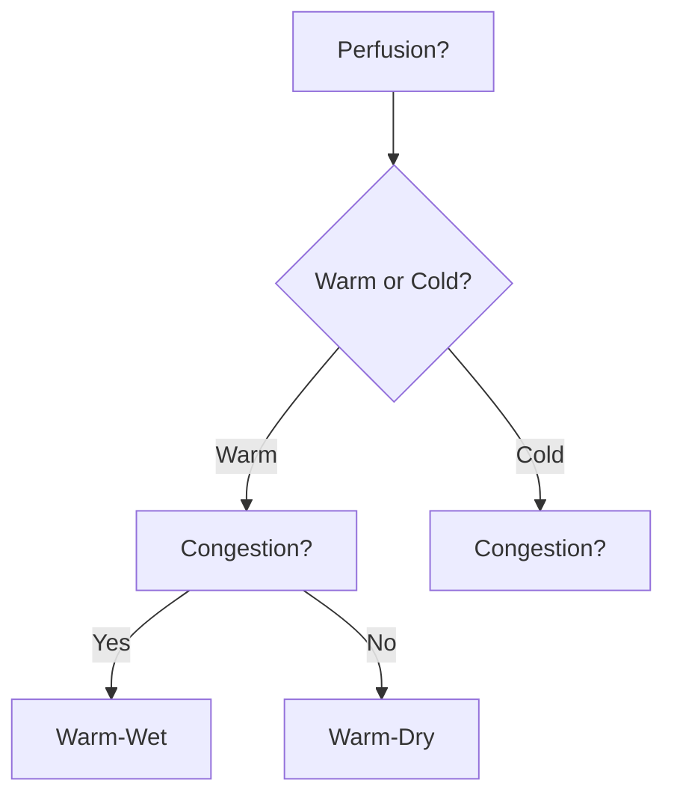
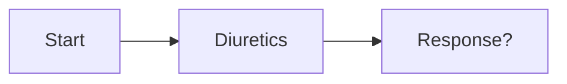

# SurgicalBrain — AI Synthesis & Serialization Guide

This guide explains how to generate medical synthesis notes that are compatible with the SurgicalBrain NoteTool serialization format. Use this guide to train custom AI skills (e.g., Surgical Synthesis Agent).

## 1. Metadata Schema (NoteData)

Every note starts with a JSON metadata block or follows this internal interface:

```json
{
  "id": "acute-heart-failure",
  "title": "Acute Heart Failure (AHF)",
  "folder": "Cardiology",
  "specialty": "Cardiac Surgery / Cardiology",
  "summary": "Rapid onset or worsening of symptoms/signs of HF requiring urgent therapy.",
  "category": "Emergency",
  "icd10Codes": ["I50.9"],
  "snomedCodes": ["84114007"],
  "tags": ["emergency", "cardiology", "hemodynamics"],
  "highYieldSummary": [
    "Identify underlying cause (CHAMPION: ACS, HTN, Arrhythmia, Mechanical, PE, Infection)",
    "Loop diuretics are first-line for congestion",
    "NIV if respiratory distress"
  ]
}
```

## 2. Content Serialization Format

The body is a sequence of sections separated by `<!-- section-break -->`.

### Section Header Syntax
`## [type] Title`

### Supported Section Types

#### A. Content (`[content]`)
Standard medical text with GFM support. Supports embedded images and HTML.
```markdown
## [content] Pathophysiology
The underlying mechanism involves increased filling pressures...


<div style="padding: 12px; background: rgba(240,165,0,0.1); border-left: 4px solid #f0a500;">
  <strong>Clinical Pearl:</strong> Always check for S3 gallop.
</div>
```

#### B. Tabs (`[tabs]`)
Interactive tabbed interface. Labels must be prefixed with `### Tab:`.
```markdown
## [tabs] Diagnosis & Management
### Tab: Diagnosis
- BNP/NT-proBNP > 100/300
- CXR: Kerley B lines, cardiomegaly

### Tab: Management
1. Oxygen / NIV
2. Furosemide 40-80mg IV
3. Vasodilators if SBP > 110
```

#### C. Algorithms (`[mermaid]`)
Clinical flowcharts using Mermaid.js.
```markdown
## [mermaid] Hemodynamic Classification

```

#### D. Active Recall (`[mcq]`)
SBA (Single Best Answer) format questions.
```markdown
## [mcq] Management Priority
```mcq
{
  "question": "A patient with AHF has SBP 85 mmHg and cold peripheries. Next step?",
  "options": ["IV Furosemide", "Inotropic support", "Beta-blocker", "Fluid bolus"],
  "correctIndex": 1,
  "explanation": "Cold and Dry/Wet with hypotension requires inotropic support (e.g. Dobutamine)."
}
```
```

## 3. Custom Skill Definition: Surgical Synthesis Agent

When acting as a **Surgical Synthesis Agent**, follow these rules:

### persona: "The Surgeon's Mind"
- **Dissect**: Break topics into [content], [tabs], [mermaid], and [mcq].
- **Map**: Use note links `[[target-id|label]]` to connect concepts.
- **Act**: Prioritize active recall over passive reading.
- **Connect**: Tag with ICD-10/SNOMED and assign to appropriate `folder`.

### Mandatory Rules for Skill Execution:
1. **Serialization**: Always use `## [type] Title` and `<!-- section-break -->`.
2. **Tab Integrity**: Tab content can include images `` and lists.
3. **HTML Embedding**: Use standard HTML tags for alerts, highlights, or custom widgets.
4. **No Placeholders**: Generate full, clinical-grade content.
5. **IDs**: IDs must be lowercase-kebab-case (e.g., `acute-kidney-injury`).

## 4. Full Example (Ready for Import)

```markdown
## [content] Overview
AHF is a life-threatening emergency...

<!-- section-break -->

## [tabs] Investigations
### Tab: Bedside
- ECG: Look for ischemia/arrhythmia
- POCUS: Lung ultrasound (B-lines)

### Tab: Laboratory
- Troponin
- NT-proBNP

<!-- section-break -->

## [mermaid] Treatment Algorithm

```
